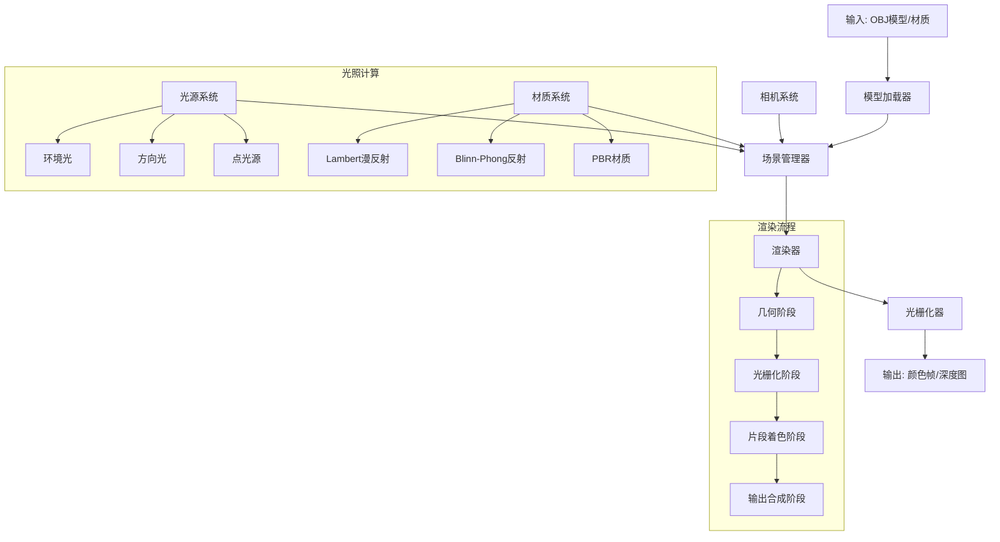
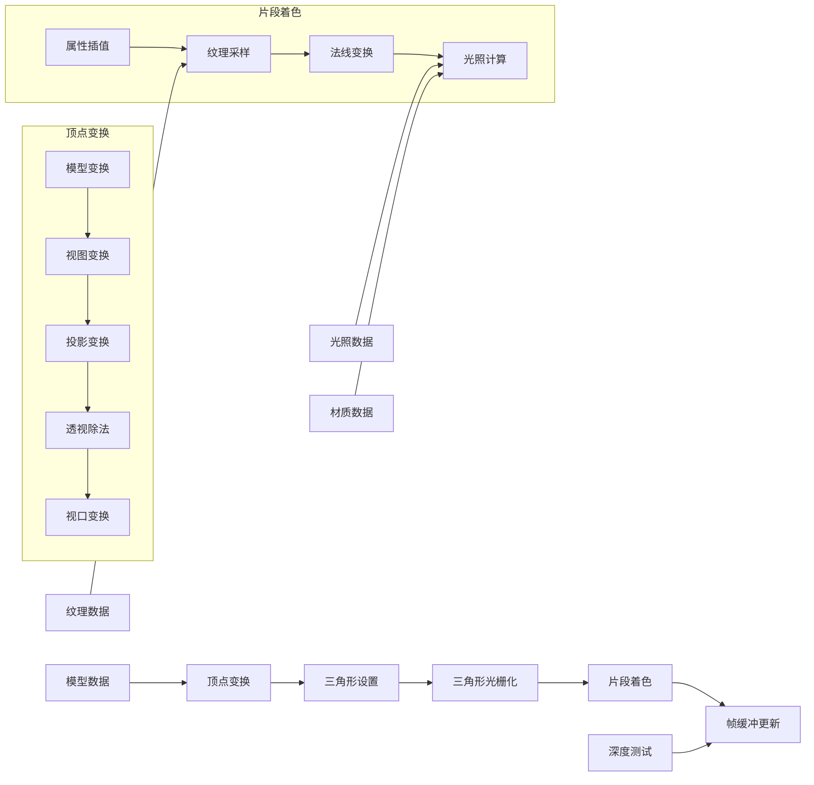
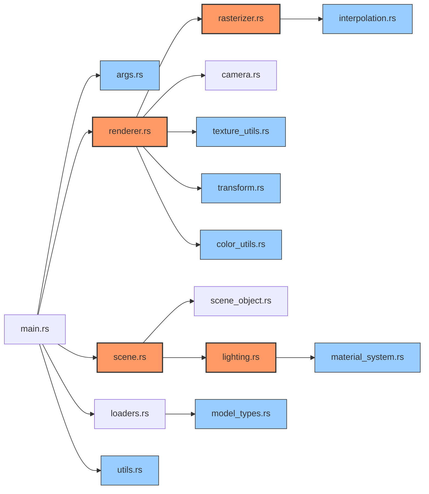

# Rasterizer_rust

一个使用Rust语言实现的高性能软件光栅化器，支持3D模型渲染、纹理映射、光照效果和基于物理的渲染(PBR)。

## 项目概述

本项目是一个从零开始实现的软件光栅化渲染器，无需依赖OpenGL等图形API，完全由CPU计算所有渲染步骤。渲染器利用Rust的安全性和并行计算能力，实现了高效的三角形光栅化、深度测试、光照计算、PBR材质系统和纹理映射等功能。

## 主要功能

- **3D模型加载**: 支持OBJ格式模型的加载和渲染
- **多种投影方式**: 支持透视投影和正交投影
- **光照模型**: 实现了环境光、方向光和点光源，以及Blinn-Phong着色模型
- **基于物理的渲染(PBR)**: 实现了基于金属度/粗糙度的PBR着色模型，可精确控制材质外观
- **纹理映射**: 支持图片纹理加载和UV映射
- **多种着色方式**: 支持平面着色(Flat Shading)、Phong着色(逐像素光照)和PBR着色
- **Z缓冲**: 实现了线程安全的深度测试
- **动画渲染**: 支持相机轨道动画生成
- **深度可视化**: 可输出深度图
- **多对象渲染**: 支持在同一场景中渲染多个对象实例
- **Gamma校正**: 实现了gamma校正以获得更准确的颜色显示
- **场景管理**: 支持多对象管理、实例化和变换
- **全局/局部变换**: 支持全局坐标系和局部坐标系的对象变换
- **材质系统**: 支持多种材质模型和属性设置，包括金属度、粗糙度、基础颜色、自发光和环境光遮蔽
- **高性能计算**: 利用多线程并行处理和SIMD指令加速渲染
- **环境反射**: 支持简化的环境反射效果（用于PBR金属材质）
- **简单后处理**: 支持简单的后处理效果如颜色调整

## 渲染架构

本渲染器遵循现代渲染引擎的架构设计，包含以下主要组件：



## 数据流

每个渲染帧的数据流程如下：



## 渲染管线

渲染器实现了完整的图形渲染管线，包括：

1. **模型加载**: 从OBJ文件加载顶点、法线、纹理坐标和材质信息
2. **模型标准化**: 将模型居中并缩放到标准尺寸
3. **顶点变换**:
   - 世界变换: 模型空间 → 世界空间
   - 视图变换: 世界空间 → 相机空间
   - 投影变换: 相机空间 → 裁剪空间
   - 透视除法: 裁剪空间 → NDC(标准化设备坐标)
   - 视口变换: NDC → 屏幕坐标
4. **三角形设置**: 准备三角形数据，包括背面剔除
5. **三角形光栅化**:
   - 计算包围盒
   - 逐像素处理
   - 重心坐标计算
   - 深度插值与测试
   - 属性插值(纹理坐标、法线等)
6. **片段着色**:
   - 纹理采样
   - 光照计算(环境光、漫反射、镜面反射)
7. **帧缓冲更新**: 将计算结果写入颜色缓冲区
8. **Gamma校正**: 在输出前进行gamma校正，获得更自然的视觉效果

## 关键技术实现

### 1. 重心坐标插值

使用重心坐标进行顶点属性的插值，并实现了透视校正插值，确保纹理映射和其他属性在透视投影下的正确性：

```rust
pub fn interpolate_texcoords(
    bary: Vector3<f32>,
    tc1: Vector2<f32>,
    tc2: Vector2<f32>,
    tc3: Vector2<f32>,
    z1_view: f32,
    z2_view: f32,
    z3_view: f32,
    is_perspective: bool,
) -> Vector2<f32> {
    // 透视校正插值实现...
}
```

### 2. 光照计算

实现了Blinn-Phong光照模型，支持环境光、漫反射和镜面反射计算：

```rust
pub fn calculate_blinn_phong(
    point: Point3<f32>,
    normal: Vector3<f32>,
    view_dir: Vector3<f32>,
    light: &Light,
    material: &SimpleMaterial,
) -> Color {
    // Blinn-Phong 光照计算...
}
```

### 3. 线程安全的Z缓冲

使用原子操作确保多线程渲染时深度缓冲的一致性：

```rust
let current_depth_atomic = &depth_buffer[pixel_index];
let old_depth_before_update = current_depth_atomic
    .fetch_min(interpolated_depth, Ordering::Relaxed);
```

### 4. 并行三角形处理

使用Rayon库实现三角形并行光栅化，大幅提升渲染性能：

```rust
triangles_to_render.par_iter().for_each(|triangle_data| {
    rasterize_triangle(
        triangle_data,
        self.frame_buffer.width,
        self.frame_buffer.height,
        &self.frame_buffer.depth_buffer,
        &self.frame_buffer.color_buffer,
    );
});
```

### 5. 场景管理

实现了场景管理系统，支持多对象实例化和动态变换：

```rust
// 添加模型并获取ID
let model_id = scene.add_model(model_data);

// 创建对象并添加到场景
let main_object = SceneObject::new_default(model_id);
scene.add_object(main_object, Some("main"));

// 创建环形对象阵列
scene.create_object_ring(model_id, count - 1, radius, Some("satellite"));
```

### 6. 基于物理的渲染 (PBR)

实现了基于金属度/粗糙度工作流的简化版 PBR 渲染系统，提供更真实的材质表现：

```rust
// PBR 材质定义
pub struct PBRMaterial {
    /// 基础色/反照率，非金属材质时代表漫反射颜色
    pub base_color: Vector3<f32>,
    /// 金属度，0.0 为绝缘体，1.0 为金属
    pub metallic: f32,
    /// 粗糙度，影响微表面分布，0.0 为完全光滑，1.0 为非常粗糙
    pub roughness: f32,
    /// 环境光遮蔽
    pub ambient_occlusion: f32,
    // ...其他PBR相关属性
}

// Cook-Torrance BRDF 计算
let d = distribution_ggx(n_dot_h, roughness); // 法线分布函数
let f = fresnel_schlick(h_dot_v, f0);        // 菲涅耳项
let g = geometry_smith(n_dot_v, n_dot_l, roughness); // 几何遮蔽函数

// Cook-Torrance 镜面反射项
let specular = (d * g * f) / (4.0 * n_dot_v * n_dot_l).max(0.001);
```

### 7. 全局与局部坐标系变换

支持不同坐标系下的对象变换，实现更灵活的场景构建：

```rust
// 在局部坐标系旋转（后乘变换矩阵）
pub fn rotate_local(&mut self, axis: &Vector3<f32>, angle_rad: f32) {
    let rotation_matrix = Matrix4::from_axis_angle(&Unit::new_normalize(*axis), angle_rad);
    self.transform *= rotation_matrix; // 后乘以实现局部旋转
}

// 在世界坐标系旋转（前乘变换矩阵）
pub fn rotate_global(&mut self, axis: &Vector3<f32>, angle_rad: f32) {
    let rotation_matrix = Matrix4::from_axis_angle(&Unit::new_normalize(*axis), angle_rad);
    self.transform = rotation_matrix * self.transform; // 前乘以实现全局旋转
}
```

## 使用方法

### 编译

```bash
# 使用Cargo构建
cargo build --release

# 或使用Makefile构建
make build
```

### 使用Cargo运行

基本渲染：

```bash
# 基本渲染示例
cargo run --release -- --obj obj/simple/bunny.obj --width 800 --height 600 --output bunny

# 带方向光的渲染
cargo run --release -- --obj obj/simple/bunny.obj --light-type directional --light-dir "0,-1,-1" --output bunny_lit

# 带点光源的渲染
cargo run --release -- --obj obj/simple/bunny.obj --light-type point --light-pos "1,2,2" --light-atten "1,0.1,0.01" --output bunny_point_light

# 使用Phong着色
cargo run --release -- --obj obj/simple/bunny.obj --use-phong --output bunny_phong
```

带纹理渲染：

```bash
# 带纹理的模型渲染
cargo run --release -- --obj obj/models/spot/spot_triangulated.obj --texture obj/models/spot/spot_texture.png --output spot_textured

# 禁用纹理，仅使用基础材质颜色
cargo run --release -- --obj obj/models/spot/spot_triangulated.obj --no-texture --output spot_no_texture
```

投影和视角：

```bash
# 透视投影（默认）
cargo run --release -- --obj obj/simple/bunny.obj --projection perspective --output bunny_perspective

# 正交投影
cargo run --release -- --obj obj/simple/bunny.obj --projection orthographic --output bunny_ortho

# 自定义相机位置
cargo run --release -- --obj obj/simple/bunny.obj --camera-from "0,1,3" --camera-at "0,0,0" --output bunny_custom_view
```

动画和特殊效果：

```bash
# 生成轨道动画（相机绕模型旋转）
cargo run --release -- --obj obj/simple/bunny.obj --animate --output-dir bunny_orbit

# 多对象渲染（在场景中创建多个实例）
cargo run --release -- --obj obj/simple/bunny.obj --object-count 5 --animate --output-dir multi_bunny

# 禁用Gamma校正
cargo run --release -- --obj obj/simple/bunny.obj --no-gamma --output bunny_no_gamma

# 使用基于物理的渲染 (PBR)
cargo run --release -- --obj obj/models/spot/spot_triangulated.obj --use-pbr --output spot_pbr

# 使用PBR渲染并自定义金属度和粗糙度
cargo run --release -- --obj obj/collect1/sphere.obj --use-pbr --metallic 0.8 --roughness 0.2 --output sphere_metal
```

### 使用Makefile运行

项目包含了预配置的Makefile，提供了多种便捷的命令：

```bash
# 渲染单帧图像（使用默认配置）
make run

# 渲染动画序列
make animate

# 运行斯坦福兔子模型演示（带轨道动画）
make bunny_demo

# 为兔子动画生成视频（需要安装ffmpeg）
make bunny_video

# 运行带纹理的奶牛模型演示
make spot_demo

# 为奶牛模型动画生成视频
make spot_video

# Gamma校正对比演示
make bunny_gamma

# 透视和正交投影对比演示
make bunny_ortho

# 多对象渲染演示
make multi_objects

# 奶牛模型Phong着色对比演示
make spot_phong

# 球体金属材质效果对比演示
make sphere_metal

# 清理构建和输出文件
make clean
```

Makefile提供了多种可配置选项，如渲染分辨率、相机参数和光照设置等。可以直接编辑Makefile或通过命令行覆盖这些设置：

```bash
# 自定义分辨率和输出目录
make run WIDTH=1920 HEIGHT=1080 OUTPUT_DIR=my_renders

# 使用特定模型和相机设置
make run OBJ_FILE=obj/models/your_model.obj CAMERA_FROM="0,2,5" CAMERA_FOV=60.0

# 使用点光源而非方向光
make run LIGHT_TYPE=point LIGHT_POS="2,2,2"

# 禁用特定功能
make run NO_ZBUFFER=true NO_TEXTURE=true
```

## 渲染示例命令一览

以下是几个常用的渲染命令组合，可直接复制使用：

### 1. 使用各种着色选项渲染兔子模型

```bash
# 基础渲染
make run OBJ_FILE=obj/simple/bunny.obj OUTPUT_NAME=bunny_basic

# 使用Phong着色
make run OBJ_FILE=obj/simple/bunny.obj USE_PHONG=true OUTPUT_NAME=bunny_phong

# 禁用深度测试（用于调试）
make run OBJ_FILE=obj/simple/bunny.obj NO_ZBUFFER=true OUTPUT_NAME=bunny_no_zbuffer

# 使用随机颜色渲染每个三角形（用于调试）
make run OBJ_FILE=obj/simple/bunny.obj COLORIZE=true OUTPUT_NAME=bunny_colorized
```

### 2. 渲染带纹理的奶牛模型

```bash
# 带纹理渲染
make run OBJ_FILE=obj/models/spot/spot_triangulated.obj \
  TEXTURE_FILE=obj/models/spot/spot_texture.png \
  OUTPUT_NAME=spot_textured

# 带纹理的点光源渲染
make run OBJ_FILE=obj/models/spot/spot_triangulated.obj \
  TEXTURE_FILE=obj/models/spot/spot_texture.png \
  LIGHT_TYPE=point LIGHT_POS="2,3,4" \
  OUTPUT_NAME=spot_point_light
```

### 3. 使用PBR材质渲染

```bash
# 带金属材质效果的球体渲染
make run OBJ_FILE=obj/collect1/sphere.obj \
  USE_PBR=true METALLIC=0.8 ROUGHNESS=0.2 \
  OUTPUT_NAME=sphere_metal_high

# 非金属材质效果的球体渲染
make run OBJ_FILE=obj/collect1/sphere.obj \
  USE_PBR=true METALLIC=0.0 ROUGHNESS=0.6 \
  OUTPUT_NAME=sphere_nonmetal

# 同时使用不同PBR材质参数对比（使用预设的make目标）
make sphere_metal
```

### 4. 自定义场景渲染

```bash
# 使用多对象
make run OBJ_FILE=obj/simple/bunny.obj \
  OUTPUT_DIR=my_scene \
  WIDTH=1920 HEIGHT=1080 \
  CAMERA_FROM="0,2,5" CAMERA_AT="0,0,0" \
  OBJECT_COUNT=5 \
  ANIMATE=true
```

### 5. 生成最终演示视频

```bash
# 分步执行以下命令可以生成高质量演示视频
make bunny_demo
make bunny_video
make spot_demo
make spot_video
```

## 项目结构

```bash
src/
├── main.rs       # 程序入口和命令行参数处理
├── args.rs       # 命令行参数定义
├── renderer.rs   # 渲染器核心，负责整体渲染流程
├── rasterizer.rs # 三角形光栅化实现
├── camera.rs     # 相机设置和矩阵计算
├── scene.rs      # 场景管理系统
├── scene_object.rs # 场景对象定义和变换
├── lighting.rs   # 光照模型实现
├── material_system.rs # 材质系统实现
├── texture_utils.rs # 纹理加载和采样
├── color_utils.rs # 颜色处理工具
├── interpolation.rs # 属性插值功能
├── transform.rs  # 坐标变换函数
├── loaders.rs    # OBJ模型和材质加载
├── model_types.rs # 模型数据结构定义
└── utils.rs      # 通用工具函数
```

下面是主要模块的依赖关系：



## 性能优化

本渲染器采用了多种性能优化策略：

1. **多线程渲染**：使用Rayon库实现三角形并行光栅化
2. **早期剔除**：实现三角形剔除，跳过不可见的三角形
3. **边界检查优化**：使用包围盒减少像素处理量
4. **深度测试优化**：使用原子操作提高多线程下深度测试性能
5. **SIMD优化**：利用现代CPU的SIMD指令加速向量计算

## 代码状态

该项目是一个功能完整的软件渲染器。当前实现了所有基本的渲染功能，包括模型加载、光栅化、光照计算、材质系统和纹理映射等。

## 未来改进方向

- 优化深度缓冲区的并行访问性能
- 实现更多高级材质模型和参数
- 添加更多的图元支持(点、线)
- 实现层次包围盒加速三角形遍历
- 添加后处理效果如抗锯齿、景深等
- 添加阴影映射支持
- 实现简单的实时编辑器界面
- 添加骨骼动画支持
- 实现更多的光照技术如环境光遮蔽(AO)

## 许可证

本项目采用 MIT 许可证。详见 [LICENSE](LICENSE) 文件。
