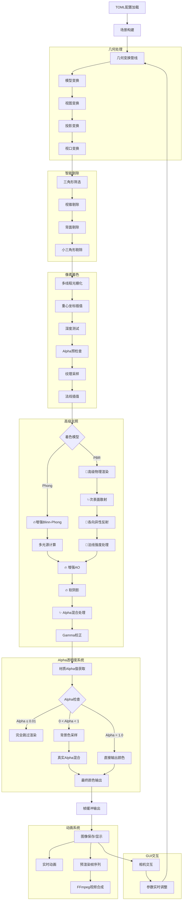

# Rust 高性能光栅化渲染器 v2.3 🎨

一个功能完备的软件光栅化渲染器，采用**TOML驱动配置**和**现代化GUI界面**。支持从基础几何渲染到**高级PBR材质系统**、**真实Alpha透明度渲染**、**增强次表面散射**、多光源系统、实时相机交互、配置文件管理等专业级渲染功能。

[](https://www.rust-lang.org/)
[](https://opensource.org/licenses/MIT)
[](https://github.com/Rukkhadevata123/Rasterizer_rust)

## 🔥 v2.3 核心特性

### ✨ **真实Alpha透明度渲染系统**

- **� 真实Alpha混合** - 与背景图片、渐变、地面平面的真实混合
- **🎯 智能深度处理** - 透明物体不干扰深度测试
- **�🎨 统一材质透明度** - PBR和Phong模式下的一致透明效果
- **⚡ 性能优化** - 完全透明像素智能跳过，提升渲染效率

### 🎨 **增强的材质系统**

- **🔬 扩展PBR参数** - 次表面散射、各向异性、法线强度控制
- **✨ 次表面散射** - 皮肤、蜡烛、大理石等半透明材质效果
- **🌟 各向异性反射** - 金属拉丝、织物等方向性材质
- **📐 可调法线强度** - 精细控制表面细节和凹凸效果
- **💎 Phong增强** - 独立漫反射和镜面反射强度控制
- **💫 材质通用属性** - 统一的基础颜色、透明度、自发光管理

### 📝 **TOML 配置驱动**

- **完整的TOML配置支持** - 所有渲染参数均可通过配置文件设置
- **配置文件管理** - 一键加载/保存配置，示例配置生成
- **参数验证系统** - 智能检测并提示配置错误
- **向后兼容** - CLI参数与TOML配置无缝集成

### 🖥️ **现代化GUI界面**

- **专业级相机交互** - 鼠标拖拽、Shift+轨道旋转、滚轮缩放
- **实时参数调整** - 所见即所得的参数编辑体验
- **重新设计的UI布局** - 材质通用属性统一管理，减少重复控制
- **中文界面支持** - 完整的本地化用户界面

### ⚡ **高性能渲染引擎**

- **多线程光栅化** - 充分利用现代多核CPU性能
- **智能剔除系统** - 背面剔除、视锥剔除、小三角形剔除
- **增强AO算法** - 基于法线、边缘、曲率的高级环境光遮蔽
- **软阴影效果** - 多光源软阴影，可调强度控制

### 🎬 **动画与视频系统**

- **实时动画渲染** - 支持相机轨道和物体旋转动画
- **预渲染模式** - 预计算帧序列，确保流畅播放
- **视频生成** - 集成FFmpeg，一键生成MP4动画
- **帧率统计** - 实时FPS监控和性能分析

## 目录

- [安装与构建](#安装与构建)
- [快速开始](#快速开始)
- [配置文件详解](#配置文件详解)
- [透明度渲染系统](#透明度渲染系统)
- [材质系统详解](#材质系统详解)
- [GUI使用指南](#gui使用指南)
- [命令行模式](#命令行模式)
- [渲染管线](#渲染管线)
- [项目架构](#项目架构)
- [示例与教程](#示例与教程)

## 安装与构建

### 环境要求

- **Rust**: 1.81+ (推荐最新稳定版)
- **依赖库**: 自动通过Cargo管理
- **FFmpeg**: (可选) 用于视频生成功能

#### 安装FFmpeg

**Windows**:

```powershell
# 使用Chocolatey
choco install ffmpeg

# 使用Winget
winget install Gyan.FFmpeg

# 或从官网下载并添加到PATH
# https://ffmpeg.org/download.html
```

**macOS**:

```bash
brew install ffmpeg
```

**Ubuntu/Debian**:

```bash
sudo apt-get update
sudo apt-get install ffmpeg libxcb-render0-dev libxcb-shape0-dev libxcb-xfixes0-dev libxkbcommon-dev libssl-dev pkg-config
```

### 构建步骤

```bash
# 1. 克隆项目
git clone https://github.com/Rukkhadevata123/Rasterizer_rust
cd Rasterizer_rust

# 2. 构建 (开发模式)
cargo build

# 3. 构建 (发布模式，推荐)
cargo build --release

# 4. 运行
cargo run --release
```

## 快速开始

### 🚀 GUI模式 (推荐)

```bash
# 启动GUI (默认配置)
cargo run --release

# 从配置文件启动GUI
cargo run --release -- --config my_config.toml

# 使用示例配置启动GUI
cargo run --release -- --use-example-config
```

### ⚡ 命令行模式

```bash
# 生成示例配置文件
cargo run --release -- --use-example-config --headless

# 使用配置文件进行无头渲染
cargo run --release -- --config example_config.toml --headless
```

## 配置文件详解

### 基础配置结构

```toml
# config.toml - 完整配置示例

[files]
obj = "obj/models/spot/spot_triangulated.obj"
output = "my_render"
output_dir = "output"
texture = "obj/models/spot/spot_texture.png"          # 可选
background_image = "backgrounds/skybox.jpg"           # 可选

[render]
width = 1920
height = 1080
projection = "perspective"                             # "perspective" | "orthographic"
use_zbuffer = true
use_texture = true
use_gamma = true
backface_culling = true
enhanced_ao = true                                     # 🔥 增强环境光遮蔽
soft_shadows = true                                    # 🔥 软阴影效果

[camera]
from = "2.5,1.5,4.0"                                  # 相机位置
at = "0,0.5,0"                                        # 观察目标
up = "0,1,0"                                          # 上方向
fov = 60.0                                            # 视场角(度)

[object]
position = "0,0.2,0"                                  # 物体位置
rotation = "15,30,0"                                  # 旋转角度(度)
scale_xyz = "1.2,1.0,1.2"                           # 非均匀缩放
scale = 1.5                                           # 全局缩放

[lighting]
use_lighting = true
ambient = 0.2                                         # 环境光强度
ambient_color = "0.2,0.3,0.4"                       # 环境光颜色

# 🔥 多光源配置 - 支持任意数量的光源
[[light]]
type = "directional"
enabled = true
direction = "0.3,-0.8,-0.5"
color = "1.0,0.95,0.8"
intensity = 0.8

[[light]]
type = "point"
enabled = true
position = "2.0,3.0,2.0"
color = "1.0,0.8,0.6"
intensity = 2.5
constant_attenuation = 1.0
linear_attenuation = 0.09
quadratic_attenuation = 0.032

[material]
use_phong = false                                     # Phong着色
use_pbr = true                                        # 🔥 推荐使用PBR

# === 💫 材质通用属性 ===
alpha = 0.75                                         # ✨ 透明度 (0.0-1.0)
emissive = "0.0,0.0,0.0"                            # 自发光颜色

# === 🎨 Phong 增强参数 ===
diffuse_color = "0.7,0.5,0.3"                       # 漫反射颜色
diffuse_intensity = 1.2                             # 🔥 漫反射强度 (0.0-2.0)
specular_color = "0.9,0.8,0.7"                      # 🔥 镜面反射颜色 (RGB)
specular_intensity = 0.8                            # 🔥 镜面反射强度 (0.0-2.0)
shininess = 64.0                                     # 光泽度

# === 🔬 高级 PBR 参数 ===
base_color = "0.85,0.7,0.6"                         # 基础颜色
metallic = 0.0                                       # 金属度 (0.0-1.0)
roughness = 0.6                                      # 粗糙度 (0.0-1.0)
ambient_occlusion = 0.8                              # 环境光遮蔽

# 🔥 v2.3 高级效果
subsurface = 0.7                                     # ✨ 次表面散射强度 (0.0-1.0)
anisotropy = 0.0                                     # 🌟 各向异性 (-1.0 到 1.0)
normal_intensity = 0.8                               # 📐 法线强度 (0.0-2.0)

# === 阴影和环境光遮蔽设置 ===
enhanced_ao = true
ao_strength = 0.6
soft_shadows = true
shadow_strength = 0.8

[background]
use_background_image = false
enable_gradient_background = true                      # 渐变背景
gradient_top_color = "0.3,0.5,0.8"
gradient_bottom_color = "0.8,0.6,0.4"
enable_ground_plane = true                            # 地面平面
ground_plane_color = "0.4,0.6,0.3"
ground_plane_height = -0.5

[animation]
animate = false                                       # CLI动画模式
fps = 60                                             # 视频帧率
rotation_speed = 0.8                                 # 实时渲染速度
rotation_cycles = 2.0                                # 视频旋转圈数
animation_type = "CameraOrbit"                       # "CameraOrbit" | "ObjectLocalRotation" | "None"
rotation_axis = "Y"                                  # "X" | "Y" | "Z" | "Custom"
custom_rotation_axis = "0.2,1,0.3"                  # 自定义轴(当rotation_axis="Custom")
```

## 透明度渲染系统

### ✨ v2.3 真实Alpha透明度特性

v2.3版本引入了业界领先的Alpha透明度渲染系统：

```toml
[material]
alpha = 0.6                                          # ✨ 材质透明度
```

#### 🌟 真实背景色混合

透明物体会与真实背景进行Alpha混合：

- **🖼️ 背景图片** - 直接与图片像素混合
- **🌈 渐变背景** - 与渐变色彩混合
- **🏔️ 地面平面** - 与地面纹理混合
- **⚫ 纯色背景** - 与设定背景色混合

```toml
# 透明玻璃效果配置
[material]
use_pbr = true
base_color = "0.9,0.95,1.0"                         # 轻微蓝色调
alpha = 0.3                                          # 高透明度
metallic = 0.0                                       # 非金属
roughness = 0.05                                     # 极光滑
subsurface = 0.1                                     # 轻微次表面散射

[background]
enable_gradient_background = true
gradient_top_color = "0.4,0.6,1.0"                  # 天空蓝
gradient_bottom_color = "1.0,0.9,0.7"               # 地平线
```

#### ⚡ 性能优化特性

- **智能深度处理** - 完全透明(alpha≤0.01)的像素跳过深度写入
- **避免深度冲突** - 防止透明物体阻挡后续渲染
- **减少计算开销** - 透明像素智能优化着色计算

#### 🎯 使用场景

```toml
# 🧊 冰块效果
[material]
alpha = 0.7
base_color = "0.95,0.98,1.0"
roughness = 0.1
subsurface = 0.3

# 💧 水面效果  
[material]
alpha = 0.4
base_color = "0.1,0.3,0.8"
roughness = 0.0
anisotropy = 0.6                                     # 水面反射方向性

# 🌫️ 雾气效果
[material]
alpha = 0.15
base_color = "0.9,0.9,0.95"
subsurface = 0.8                                     # 强散射模拟雾气
```

## 材质系统详解

### 💫 材质通用属性管理

v2.3版本重新设计了材质UI，将通用属性统一管理：

```toml
[material]
# === 通用属性（适用于PBR和Phong） ===
alpha = 0.8                                          # ✨ 透明度
emissive = "0.1,0.05,0.0"                           # 自发光（如发光材质）

# 基础颜色（智能适配）
# PBR模式下作为base_color
# Phong模式下作为diffuse_color
```

### 🎨 Phong 增强着色模型

v2.3版本大幅增强了Phong着色模型，提供更精细的控制：

```toml
[material]
use_phong = true

# 🔥 独立强度控制
diffuse_color = "0.8,0.6,0.4"                       # 漫反射基色
diffuse_intensity = 1.5                             # 漫反射增强 50%

specular_color = "1.0,0.9,0.8"                      # 镜面反射色调
specular_intensity = 0.6                            # 降低镜面反射 40%

shininess = 128.0                                    # 高光泽度（锐利高光）
alpha = 0.9                                          # ✨ 轻微透明
```

**Phong参数详解**：

| 参数 | 范围 | 效果描述 |
|------|------|----------|
| `alpha` | 0.0-1.0 | **✨ 透明度**，0为完全透明，1为不透明 |
| `diffuse_intensity` | 0.0-2.0 | **漫反射强度**，控制表面亮度 |
| `specular_intensity` | 0.0-2.0 | **镜面反射强度**，控制高光亮度 |
| `shininess` | 1.0-512.0 | **光泽度**，值越高高光越锐利 |
| `diffuse_color` | RGB | **漫反射颜色**，物体主要颜色 |
| `specular_color` | RGB | **🔥 镜面反射颜色**，高光色调 |

### 🔬 高级 PBR 材质系统

v2.3版本引入了业界领先的PBR参数：

```toml
[material]
use_pbr = true

# 基础PBR三要素
base_color = "0.8,0.6,0.4"                          # 基础反射率
metallic = 0.2                                       # 轻微金属感
roughness = 0.3                                      # 中等粗糙度
alpha = 0.8                                          # ✨ 透明度

# 🔥 v2.3 高级效果
subsurface = 0.8                                     # ✨ 强次表面散射
anisotropy = 0.4                                     # 🌟 方向性反射
normal_intensity = 1.2                               # 📐 增强表面细节
emissive = "0.0,0.0,0.0"                            # 自发光
```

#### ✨ 次表面散射 (Subsurface Scattering)

模拟光线在材质内部的散射效果，适用于：

```toml
# 🧑 人体皮肤效果
subsurface = 0.7
base_color = "0.9,0.7,0.6"
metallic = 0.0
roughness = 0.4
alpha = 1.0                                          # 皮肤通常不透明

# 🕯️ 蜡烛材质
subsurface = 0.9
base_color = "0.95,0.9,0.8"
metallic = 0.0
roughness = 0.6
alpha = 0.8                                          # ✨ 轻微透明增强蜡质感

# 🏛️ 大理石效果
subsurface = 0.5
base_color = "0.9,0.9,0.85"
metallic = 0.1
roughness = 0.2
alpha = 0.95                                         # ✨ 几乎不透明但有微妙透光
```

#### 🌟 各向异性 (Anisotropy)

控制表面反射的方向性特征：

```toml
# 🔧 拉丝金属效果
anisotropy = 0.8                                     # 强方向性
metallic = 0.9
roughness = 0.3
base_color = "0.8,0.8,0.9"
alpha = 1.0                                          # 金属通常不透明

# 🧵 织物材质
anisotropy = -0.4                                    # 垂直方向
metallic = 0.0
roughness = 0.7
base_color = "0.6,0.4,0.3"
alpha = 0.9                                          # ✨ 织物轻微透光

# 💿 CD光盘效果
anisotropy = 0.95                                    # 极强径向反射
metallic = 0.8
roughness = 0.1
alpha = 0.85                                         # ✨ 半透明塑料基材
```

#### 📐 法线强度 (Normal Intensity)

精细控制表面细节的强度：

```toml
# 🏔️ 粗糙岩石
normal_intensity = 1.8                               # 增强凹凸感
roughness = 0.9
alpha = 1.0                                          # 岩石不透明

# 🪞 光滑表面
normal_intensity = 0.3                               # 减弱表面变化
roughness = 0.1
alpha = 0.1                                          # ✨ 透明玻璃效果

# 🎭 程序化细节
normal_intensity = 1.5                               # 适中细节
alpha = 0.6                                          # ✨ 半透明材质
```

### 🎯 材质预设示例

#### 透明材质

```toml
# � 透明冰块
[material]
use_pbr = true
base_color = "0.95,0.98,1.0"                        # 冷色调
alpha = 0.3                                          # ✨ 高透明度
metallic = 0.0                                       # 非金属
roughness = 0.05                                     # 极光滑
subsurface = 0.4                                     # 内部散射
normal_intensity = 0.8                               # 适中表面细节

# 🌊 透明水面
[material]
use_pbr = true
base_color = "0.1,0.4,0.8"                          # 水蓝色
alpha = 0.2                                          # ✨ 极高透明度
metallic = 0.0
roughness = 0.0                                      # 镜面光滑
anisotropy = 0.8                                     # 水面反射方向性
subsurface = 0.1                                     # 轻微散射
```

#### 金属材质

```toml
# 🥇 抛光金属
[material]
use_pbr = true
base_color = "1.0,0.8,0.4"                          # 金色
alpha = 1.0                                          # ✨ 完全不透明
metallic = 0.9                                       # 高金属度
roughness = 0.1                                      # 镜面光滑
anisotropy = 0.0                                     # 各向同性

# 🔩 拉丝不锈钢
[material]
use_pbr = true
base_color = "0.8,0.8,0.9"                          # 冷色金属
alpha = 1.0                                          # ✨ 不透明
metallic = 0.8
roughness = 0.3
anisotropy = 0.6                                     # 拉丝效果
normal_intensity = 1.2                               # 增强纹理
```

#### 有机材质

```toml
# 🍎 水果皮肤
[material]
use_pbr = true
base_color = "0.8,0.2,0.1"                          # 苹果红
alpha = 0.95                                         # ✨ 轻微透明
metallic = 0.0                                       # 非金属
roughness = 0.4                                      # 半光滑
subsurface = 0.6                                     # 明显次表面散射
normal_intensity = 0.8                               # 适中表面纹理

# 🧑 人体皮肤
[material]
use_pbr = true
base_color = "0.9,0.7,0.6"                          # 肤色
alpha = 1.0                                          # ✨ 完全不透明
metallic = 0.0
roughness = 0.5
subsurface = 0.8                                     # 强次表面散射
anisotropy = 0.0                                     # 各向同性
```

#### 特殊效果

```toml
# ✨ 发光透明材质
[material]
use_pbr = true
base_color = "0.2,0.4,0.8"                          # 基础蓝色
alpha = 0.4                                          # ✨ 半透明
emissive = "0.1,0.3,0.6"                            # 蓝色发光
metallic = 0.0
roughness = 0.3
subsurface = 0.4                                     # 轻微内部发光

# 🌟 全息透明材质
[material]
use_pbr = true
base_color = "0.8,0.9,1.0"                          # 冷色基调
alpha = 0.6                                          # ✨ 透明度
metallic = 0.6                                       # 部分金属性
roughness = 0.2                                      # 光滑
anisotropy = 0.8                                     # 强方向性
normal_intensity = 1.5                               # 增强细节
emissive = "0.05,0.1,0.2"                           # 轻微发光
```

## GUI使用指南

### 界面布局

```
┌─────────────────────────────────────────────────────────────┐
│ 🏠 光栅化渲染器 | 状态信息 | FPS显示 | Ctrl+R: 快速渲染    │
├──────────────┬──────────────────────────────────────────────┤
│              │                                              │
│ 🎛️ 控制面板    │           🖼️ 渲染结果显示区域                │
│              │                                              │
│ 📁 文件设置     │           🖱️ 相机交互区域                   │
│ 🎨 渲染设置     │                                              │
│ 🔧 物体变换     │           右下角: 交互提示面板               │
│ 📷 相机设置     │                                              │
│ 💡 光照设置     │                                              │
│ 🎭 材质设置     │  ← 🔥 v2.3增强：统一透明度控制             │
│ 🎬 动画设置     │                                              │
│ 🔴 渲染按钮     │                                              │
└──────────────┴──────────────────────────────────────────────┘
```

### 🎭 v2.3增强的材质设置面板

新版本的材质面板采用统一管理设计：

```
┌─────────────────────────────────────────┐
│ 🎭 光照与材质设置                        │
├─────────────────────────────────────────┤
│ 着色模型: ○ Phong  ● PBR               │
│ ━━━━━━━━━━━━━━━━━━━━━━━━━━━━━━━━━━━━━━━━━ │
│ 💫 材质通用属性                         │
│ 基础颜色: [■] [0.85, 0.70, 0.60]       │
│ ✨ 透明度:   [████████░░] 0.8           │
│ 💡 自发光:   [■] [0.0, 0.0, 0.0]       │
│ ━━━━━━━━━━━━━━━━━━━━━━━━━━━━━━━━━━━━━━━━━ │
│ 🔬 PBR 高级参数                         │
│ 金属度:   [████████░░] 0.0             │
│ 粗糙度:   [██████░░░░] 0.6             │
│ ✨ 次表面散射: [███████░░░] 0.7         │
│ 🌟 各向异性:   [█████░░░░░] 0.0         │
│ 📐 法线强度:   [████████░░] 0.8         │
│ ━━━━━━━━━━━━━━━━━━━━━━━━━━━━━━━━━━━━━━━━━ │
│ ✨ 提示: 透明度影响与背景的混合效果     │
└─────────────────────────────────────────┘
```

**v2.3材质UI改进**：

- � **统一透明度控制** - 一个滑块控制所有着色模型的透明度
- 💫 **通用属性分组** - 基础颜色、透明度、自发光统一管理
- � **智能适配** - 基础颜色自动适配PBR的base_color或Phong的diffuse_color
- � **实时提示** - 透明度变化时显示背景混合效果说明

### 🔥 配置文件管理

在"文件与输出设置"面板中：

- **📁 加载配置** - 从.toml文件加载完整配置
- **💾 保存配置** - 将当前设置保存为.toml文件
- **📋 示例配置** - 快速应用内置示例配置

```
┌─────────────────────────────────────────┐
│ 文件与输出设置                            │
├─────────────────────────────────────────┤
│ OBJ文件: [path/to/model.obj] [浏览...]   │
│ ━━━━━━━━━━━━━━━━━━━━━━━━━━━━━━━━━━━━━━━━━ │
│ 配置文件: [📁加载配置] [💾保存配置] [📋示例] │
│ 💡 提示：加载配置会覆盖当前所有设置       │
└─────────────────────────────────────────┘
```

### 🖱️ 相机交互系统

在中央渲染区域进行3D导航：

| 操作 | 功能 |
|------|------|
| **鼠标拖拽** | 平移相机视角 |
| **Shift + 拖拽** | 围绕目标轨道旋转 |
| **鼠标滚轮** | 推拉缩放 |
| **R键** | 重置到默认视角 |
| **F键** | 聚焦到物体中心 |

**敏感度调节**: 在"相机设置"面板中可独立调整平移、旋转、缩放的响应速度。

### 🎬 动画渲染模式

#### 实时动画渲染

```
[开始动画渲染] 按钮 → 立即开始旋转动画
├── 显示实时FPS统计
├── 支持相机交互调整观察角度  
├── 可调节旋转速度
└── [停止动画渲染] 停止播放
```

#### 预渲染模式

```
☑️ 启用预渲染模式 → [开始动画渲染]
├── 首次: 预先计算所有帧 (显示进度)
├── 完成后: 流畅播放预渲染帧
├── 适合复杂场景和高质量预览
└── 占用更多内存，但播放无卡顿
```

### 🎥 视频生成工作流

1. **配置参数**: 在"动画设置"中调整fps、旋转圈数、动画类型
2. **预览效果**: 使用实时动画渲染预览效果
3. **生成视频**: 点击"生成视频"按钮，后台渲染并合成MP4
4. **进度监控**: 状态栏显示渲染进度和预计时间

## 命令行模式

### CLI 参数总览

```bash
cargo run --release -- [OPTIONS]

OPTIONS:
    -c, --config <FILE>        📁 指定TOML配置文件路径
        --headless             🚀 无头模式(不启动GUI)
        --use-example-config   📋 使用示例配置
    -h, --help                 显示帮助信息
```

### 使用场景

#### 🔧 配置文件开发

```bash
# 1. 生成示例配置
cargo run --release -- --use-example-config

# 2. 编辑配置文件
notepad temp_example_config.toml  # Windows
# 或
vim temp_example_config.toml      # Linux/macOS

# 3. 测试配置 (GUI模式)
cargo run --release -- --config temp_example_config.toml

# 4. 无头批量渲染
cargo run --release -- --config temp_example_config.toml --headless
```

#### 🤖 自动化渲染

```bash
# 批量处理多个配置
for config in configs/*.toml; do
    cargo run --release -- --config "$config" --headless
done
```

## 渲染管线



## 项目架构

```
src/
├── 🏗️ core/                    # 核心渲染引擎
│   ├── frame_buffer.rs         # 🔥 帧缓冲区与背景管理（v2.3增强）
│   ├── geometry_processor.rs   # 几何变换处理器
│   ├── renderer.rs            # 主渲染器协调
│   ├── triangle_processor.rs  # 三角形处理与准备
│   ├── parallel_rasterizer.rs # 🔥 智能并行光栅化器
│   ├── rasterizer/            # 🔥 模块化光栅化系统
│   │   ├── mod.rs             # 模块导出
│   │   ├── triangle_data.rs   # 核心数据结构
│   │   ├── pixel_processor.rs # 🔥 像素处理核心（v2.3增强Alpha处理）
│   │   └── shading.rs         # ✨ 着色与Alpha混合系统（v2.3新增）
│   └── mod.rs                 # 核心模块导出
├── 📐 geometry/                # 几何处理模块  
│   ├── camera.rs              # 专业相机系统
│   ├── transform.rs           # 几何变换矩阵
│   ├── culling.rs             # 智能剔除算法
│   ├── interpolation.rs       # 插值算法
│   └── mod.rs                 # 几何模块导出
├── 📁 io/                      # 🔥 配置与IO系统
│   ├── config_loader.rs       # TOML配置管理器
│   ├── simple_cli.rs          # 极简CLI处理
│   ├── render_settings.rs     # ✨ 统一配置数据结构（v2.3增强Alpha支持）
│   ├── obj_loader.rs          # OBJ模型加载器
│   ├── model_loader.rs        # 🔥 统一模型加载接口
│   └── mod.rs                 # IO模块导出
├── 💡 material_system/         # 🔬 增强材质与光照
│   ├── light.rs               # 多光源系统
│   ├── materials.rs           # 🔥 Phong/PBR增强材质（v2.3统一Alpha处理）
│   ├── texture.rs             # 纹理管理
│   ├── color.rs               # 颜色处理
│   └── mod.rs                 # 材质系统模块导出
├── 🎬 scene/                   # 场景管理
│   ├── scene_utils.rs         # 场景构建与统计
│   ├── scene_object.rs        # 场景对象变换
│   └── mod.rs                 # 场景模块导出
├── 🖥️ ui/                      # 现代化GUI界面
│   ├── app.rs                 # eframe应用主逻辑
│   ├── widgets.rs             # ✨ 自定义UI组件（v2.3重新组织材质面板）
│   ├── render_ui.rs           # 文件选择与配置管理
│   ├── core.rs                # GUI核心方法
│   ├── animation.rs           # 动画控制逻辑
│   └── mod.rs                 # UI模块导出
├── 🛠️ utils/                   # 工具函数库
│   ├── render_utils.rs        # 渲染辅助函数
│   ├── model_utils.rs         # 模型处理工具
│   ├── save_utils.rs          # 文件保存工具
│   └── mod.rs                 # 工具模块导出
└── main.rs                    # 程序入口点
```

### 🔥 v2.3 架构亮点

- **✨ 统一Alpha透明度系统**: 跨模块的真实透明度渲染支持
- **💫 材质通用属性管理**: GUI和配置系统中的统一材质参数处理
- **🎯 配置驱动架构**: `RenderSettings`作为单一数据源，CLI/GUI/TOML三者统一
- **🔬 增强材质系统**: 次表面散射、各向异性、法线强度等高级PBR特性
- **📦 模块化设计**: 光栅化器拆分为专职模块，便于维护和扩展
- **⚡ 智能并行渲染**: 自动选择最优并行策略，Alpha优化
- **🔄 实时交互**: GUI参数变化立即反映到渲染结果
- **💾 统一状态管理**: 错误处理、进度监控、资源清理

## 示例与教程

### 📚 透明度效果示例

#### 玻璃透明材质

```bash
# 1. 创建透明玻璃配置
cargo run --release -- --use-example-config

# 2. 编辑配置实现玻璃效果
[material]
use_pbr = true
base_color = "0.9,0.95,1.0"      # 轻微蓝色调
alpha = 0.2                      # ✨ 高透明度
metallic = 0.0                   # 非金属
roughness = 0.05                 # 极光滑
subsurface = 0.1                 # 轻微散射
normal_intensity = 0.8           # 适中表面细节

[background]
enable_gradient_background = true
gradient_top_color = "0.4,0.6,1.0"
gradient_bottom_color = "1.0,0.9,0.7"

# 3. GUI模式查看透明效果
cargo run --release -- --config temp_example_config.toml
```

#### 次表面散射与透明度结合

```toml
[material]
use_pbr = true
base_color = "0.9,0.7,0.6"       # 肤色
alpha = 0.95                     # ✨ 轻微透明（皮肤微透光）
metallic = 0.0                   # 非金属
roughness = 0.4                  # 半光滑
subsurface = 0.8                 # 🔥 强次表面散射
normal_intensity = 0.8           # 适中表面细节

[[light]]
type = "directional"
direction = "0.3,-0.8,-0.5"
intensity = 1.2                  # 强光展示次表面效果

[[light]]
type = "point"                   # 背光源
position = "0.0,1.0,-2.0"
intensity = 0.6
color = "1.0,0.9,0.8"           # 暖色背光
```

#### 发光透明材质

```toml
[material]
use_pbr = true
base_color = "0.1,0.3,0.8"       # 深蓝基色
alpha = 0.4                      # ✨ 半透明
emissive = "0.2,0.4,1.0"         # 🔥 蓝色发光
metallic = 0.0
roughness = 0.2
subsurface = 0.3                 # 轻微内部散射增强发光感

# 调暗环境光突出发光效果
[lighting]
ambient = 0.05
ambient_color = "0.1,0.1,0.2"

[background]
enable_gradient_background = true
gradient_top_color = "0.05,0.05,0.1"    # 深色背景突出发光
gradient_bottom_color = "0.1,0.05,0.15"
```

### 🎬 透明度动画展示

#### 渐变透明度动画

```toml
[animation]
animation_type = "CameraOrbit"
rotation_axis = "Y"
rotation_cycles = 2.0            # 两圈展示
fps = 30

# 使用多角度光照展示透明效果
[[light]]
type = "directional"
direction = "0.5,-1.0,-0.3"
color = "1.0,0.9,0.8"            # 暖色主光
intensity = 1.2

[[light]]
type = "point"
position = "3.0,2.0,3.0"
color = "0.6,0.8,1.0"            # 冷色补光
intensity = 0.8

[[light]]
type = "point"                   # 背光源展示透明度
position = "0.0,1.0,-3.0"
color = "1.0,0.7,0.4"
intensity = 0.6
```

**操作流程**:

1. 在GUI中设置透明材质参数
2. 调整Alpha滑块观察透明度变化
3. 点击"开始动画渲染"预览旋转中的透明效果
4. 观察不同角度下的背景混合效果
5. 生成高质量视频展示透明度动画

### 🏭 生产环境配置

#### 高质量透明材质渲染

```toml
[render]
width = 2560                     # 2.5K分辨率
height = 1440
enhanced_ao = true
ao_strength = 0.8
soft_shadows = true
shadow_strength = 0.6

[material]
use_pbr = true
alpha = 0.6                      # ✨ 透明度
# 高质量次表面散射设置
subsurface = 0.7
normal_intensity = 1.0           # 保持适中避免过度
ambient_occlusion = 0.9          # 高环境光遮蔽

# 专业三点布光展示透明效果
[[light]]
type = "directional"             # 主光源
direction = "0.3,-0.8,-0.5"
intensity = 1.0
color = "1.0,0.95,0.9"

[[light]]
type = "point"                   # 补光源
position = "-2.0,1.5,2.0"
intensity = 0.6
color = "0.9,0.95,1.0"

[[light]]
type = "point"                   # 透明背光源
position = "1.5,0.5,-2.0"
intensity = 0.4
color = "1.0,0.9,0.8"
```

#### 批量透明度测试

```bash
#!/bin/bash
# transparency_test.sh - 批量测试不同透明度效果

alpha_values=(0.1 0.3 0.5 0.7 0.9)
subsurface_values=(0.0 0.3 0.6 0.9)
backgrounds=("gradient" "image" "ground")

for alpha in "${alpha_values[@]}"; do
    for subsurface in "${subsurface_values[@]}"; do
        for background in "${backgrounds[@]}"; do
            config_file="test_alpha${alpha}_ss${subsurface}_bg${background}.toml"
            
            # 生成配置文件
            cat > "$config_file" << EOF
[material]
use_pbr = true
alpha = $alpha
subsurface = $subsurface
# ... 其他材质参数

[background]
enable_gradient_background = $([ "$background" = "gradient" ] && echo "true" || echo "false")
use_background_image = $([ "$background" = "image" ] && echo "true" || echo "false")
enable_ground_plane = $([ "$background" = "ground" ] && echo "true" || echo "false")
EOF
            
            # 渲染
            cargo run --release -- --config "$config_file" --headless
            
            echo "✅ 完成: Alpha=$alpha, Subsurface=$subsurface, Background=$background"
        done
    done
done
```

## 性能优化建议

### 💻 硬件配置

- **CPU**: 推荐8核心以上，受益于多线程光栅化
- **内存**: 16GB+，支持大模型和复杂材质计算
- **存储**: SSD优先，加速纹理和模型加载

### ⚙️ 渲染设置优化

#### 高性能设置

```toml
[render]
cull_small_triangles = true      # 剔除小三角形
min_triangle_area = 0.001       # 剔除阈值
backface_culling = true         # 背面剔除

[material]
# 简化材质计算
alpha = 1.0                     # ✨ 禁用透明度（提升性能）
subsurface = 0.0                # 禁用次表面散射
anisotropy = 0.0                # 禁用各向异性
normal_intensity = 1.0          # 标准法线强度
```

#### 高质量设置

```toml
[render]
enhanced_ao = true
ao_strength = 0.8
soft_shadows = true
shadow_strength = 0.6

[material]
# 全功能材质
alpha = 0.6                     # ✨ 启用透明度
subsurface = 0.6                # 启用次表面散射
anisotropy = 0.4                # 适度各向异性
normal_intensity = 1.2          # 增强细节
```

#### 平衡设置

```toml
[render]
enhanced_ao = true
ao_strength = 0.5               # 适中AO强度
soft_shadows = true  
shadow_strength = 0.4           # 适中阴影强度

[material]
alpha = 0.8                     # ✨ 轻微透明度
subsurface = 0.3                # 轻微次表面散射
anisotropy = 0.0                # 禁用各向异性（节省计算）
normal_intensity = 1.0          # 标准细节
```

## 故障排除

### 常见问题

#### 🔧 编译问题

```bash
# 确保Rust版本
rustc --version  # 应为1.81+

# 清理重新构建
cargo clean
cargo build --release
```

#### ✨ 透明度效果不明显

```bash
# 检查背景设置
[background]
enable_gradient_background = true    # 确保有可见背景
# 或
use_background_image = true

# 检查Alpha值
[material]
alpha = 0.5                         # 确保不是1.0（完全不透明）

# 检查光照设置
[[light]]
type = "point"
position = "0.0,1.0,-2.0"          # 添加背光源增强透明效果
```

#### 🎨 材质效果不明显

```bash
# 检查光照设置
# 次表面散射需要适当的光照才能显现
[[light]]
type = "directional"
intensity = 1.0                 # 确保足够亮度

# 各向异性需要侧光源
[[light]]
type = "point"
position = "2.0,0.0,0.0"        # 侧面光源
```

#### 📁 文件加载问题

```bash
# 检查文件路径
ls -la obj/models/        # Linux/macOS
dir obj\models\           # Windows

# 验证文件格式
file model.obj            # 应显示ASCII text
```

#### 🎥 视频生成问题

```bash
# 检查FFmpeg
ffmpeg -version

# Windows安装FFmpeg
choco install ffmpeg

# 检查输出目录权限
ls -la output_directory/
```

### 📊 性能分析

#### 透明度渲染性能

```toml
# 性能测试配置
[material]
# 测试1: 不透明基线
alpha = 1.0

# 测试2: 轻微透明
alpha = 0.9

# 测试3: 半透明
alpha = 0.5

# 测试4: 高透明度
alpha = 0.2

# 测试5: 透明度+次表面散射
alpha = 0.6
subsurface = 0.5
```

在GUI中对比FPS差异，选择合适的质量/性能平衡点。

## 贡献指南

### 🛠️ 开发环境搭建

```bash
# 1. Fork项目
git clone https://github.com/Rukkhadevata123/Rasterizer_rust
cd Rasterizer_rust

# 2. 创建开发分支
git checkout -b feature/transparency-enhancement

# 3. 安装开发依赖
cargo install cargo-clippy cargo-fmt

# 4. 运行测试
cargo test
cargo clippy
cargo fmt
```

### 📝 代码规范

- **Rust风格**: 遵循官方Rust代码规范
- **注释语言**: 中文注释，英文变量名
- **提交信息**: 使用约定式提交格式
- **测试覆盖**: 新功能需要相应测试

### 🎨 透明度系统扩展

贡献透明度相关功能时，请遵循以下结构：

```rust
// src/core/rasterizer/shading.rs

// Alpha混合相关函数应放在这里
pub fn your_alpha_effect(/* 参数 */) -> Color {
    // 实现新的Alpha效果
}

// 在 apply_real_alpha_blending 中集成
// 在 RenderSettings 中添加对应参数
// 在 GUI widgets.rs 中添加控制滑块
```

## 版本历史

### 🎉 v2.3.0 (Current)

- **✨ 真实Alpha透明度渲染系统**
  - 🌟 与背景图片/渐变/地面的真实混合
  - 🎯 智能深度处理优化
  - ⚡ 完全透明像素性能优化
- **💫 材质系统UI重构**
  - 统一的材质通用属性管理
  - 简化的参数控制界面
  - 智能的着色模型适配
- **🔧 架构优化**
  - 模块化的Alpha处理系统
  - 改进的错误处理和状态管理

### 🎉 v2.2.0

- ✨ **增强PBR材质系统**
  - 🔥 次表面散射效果
  - 🌟 各向异性反射
  - 📐 可调法线强度
- 🎨 **Phong着色增强**
  - 独立漫反射/镜面反射强度控制
  - 镜面反射颜色支持
- 🖥️ **材质GUI优化**
  - 直观的参数滑块
  - 实时效果预览
  - 材质预设支持

### 🎉 v2.0.0

- ✨ **全新TOML配置系统**
- 🖥️ **现代化GUI界面重构**  
- 📁 **配置文件管理功能**
- 🔥 **增强AO和软阴影算法**
- 🎬 **预渲染动画系统**
- 🖱️ **专业级相机交互**

### v1.x Legacy

- 基础光栅化渲染器
- CLI参数配置
- 基础Phong/PBR着色模型
- 多线程渲染支持

## 许可证

本项目采用 MIT 许可证。详见 [LICENSE](LICENSE) 文件。

## 致谢

- **egui**: 现代化Rust GUI框架
- **nalgebra**: 高性能线性代数库
- **image**: 图像处理库
- **toml**: TOML配置解析
- **clap**: CLI参数解析

---

<div align="center">

**🎨 用Rust重新定义软件光栅化渲染 🎨**

**✨ v2.3: 真实Alpha透明度，专业级视觉效果 ✨**

[🔗 GitHub仓库](https://github.com/Rukkhadevata123/Rasterizer_rust) | [📚 文档](README.md) | [🐛 问题反馈](https://github.com/Rukkhadevata123/Rasterizer_rust/issues)

</div>
