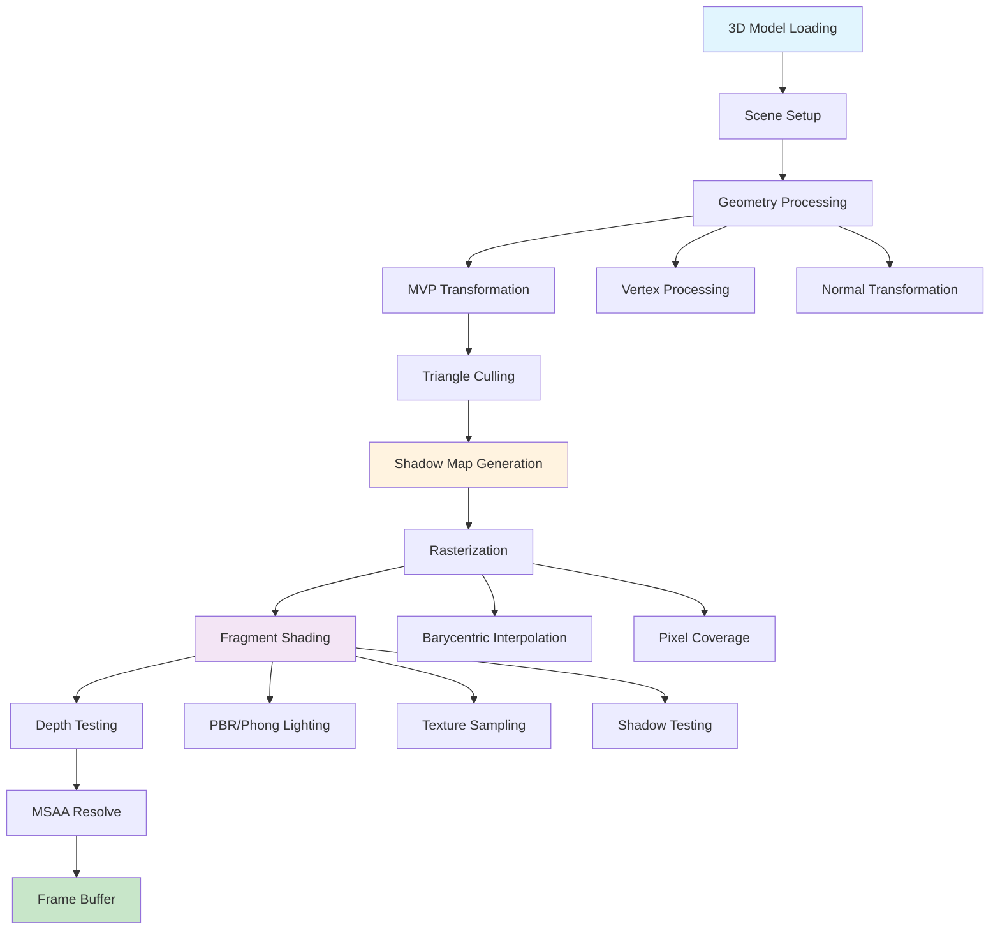
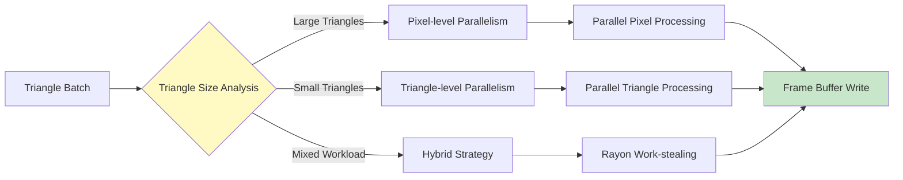

# Software Rasterization Renderer in Rust

A 3D software rasterizer implementing modern graphics pipeline with PBR materials and TOML configuration.

[](https://www.rust-lang.org/)
[](LICENSE)

## Overview

This project implements a complete 3D graphics pipeline in software, featuring:

- **PBR Material System** - Cook-Torrance BRDF with metallic-roughness workflow
- **Multi-threaded Rasterization** - Parallel triangle processing with intelligent load balancing  
- **Shadow Mapping** - Basic shadow casting for directional lights
- **MSAA Anti-aliasing** - Standard sampling patterns (2x/4x/8x)
- **Interactive GUI** - Real-time parameter adjustment with egui

## Rendering Pipeline



## Multi-threading Strategy



## Quick Start

```bash
git clone https://github.com/Rukkhadevata123/Rasterizer_rust
cd Rasterizer_rust
cargo run --release

# Use example configuration
cargo run --release -- --use-example-config

# Run headless with config
cargo run --release -- --config scene.toml --headless

# Run complex example
cargo run --release -- --config complex_config.toml
```

## Configuration

All rendering parameters are controlled via TOML files:

```toml
[files]
obj = "models/bunny.obj"
output = "render"
texture = "textures/material.jpg"  # optional

[render]
width = 1920
height = 1080
msaa_samples = 4           # 1, 2, 4, or 8
use_zbuffer = true
backface_culling = true

[camera]
from = "2.5,1.5,4.0"      # camera position
at = "0,0.5,0"            # look-at target  
fov = 60.0                # field of view (degrees)

[material]
use_pbr = true            # PBR vs Blinn-Phong
base_color = "0.8,0.7,0.6"
metallic = 0.0            # 0.0 = dielectric, 1.0 = metallic
roughness = 0.5           # 0.0 = mirror, 1.0 = rough
alpha = 1.0               # transparency

[lighting]
ambient = 0.2
ambient_color = "0.2,0.3,0.4"

[[light]]
type = "directional"
direction = "0.3,-0.8,-0.5"
color = "1.0,0.95,0.8"
intensity = 0.8

[shadow]
enable_shadow_mapping = true
shadow_map_size = 512

[background]
enable_ground_plane = true
ground_plane_color = "0.3,0.5,0.2"
ground_plane_height = -1.0
```

## Technical Implementation

### PBR Rendering

Implements Cook-Torrance BRDF with energy conservation:

```rust
// BRDF = diffuse + specular
let f_diffuse = k_d * base_color / π;
let f_specular = (D * G * F) / (4 * (N·L) * (N·V));

// Energy conservation
let k_d = (1.0 - k_s) * (1.0 - metallic);
```

**Functions:**

- **D**: GGX/Trowbridge-Reitz normal distribution
- **G**: Smith geometry function with height correlation
- **F**: Schlick Fresnel approximation

### Rasterization Pipeline

1. **Geometry Processing** - MVP transformations with parallel vertex processing
2. **Triangle Setup** - Culling and material binding
3. **Rasterization** - Barycentric coordinate interpolation with intelligent parallelization
4. **Pixel Shading** - PBR/Phong lighting with texture sampling
5. **MSAA Resolve** - Multi-sample anti-aliasing with standard patterns

### MSAA Implementation

Standard sampling patterns:

- **2x**: Diagonal `[(-0.25, -0.25), (0.25, 0.25)]`
- **4x**: Rotated grid for optimal coverage
- **8x**: Optimized 8-point distribution

## Project Structure

```
src/
├── core/                     # Core rendering pipeline
│   ├── renderer.rs          # Main renderer orchestrator
│   ├── rasterizer.rs        # Triangle rasterization engine
│   ├── frame_buffer.rs      # Color/depth buffer management
│   ├── geometry.rs          # Geometry transformation pipeline
│   └── shadow_map.rs        # Shadow mapping implementation
├── material_system/          # Material and lighting system
│   ├── materials.rs         # PBR and Blinn-Phong materials
│   ├── light.rs             # Light sources (directional/point)
│   ├── texture.rs           # Texture loading and sampling
│   └── color.rs             # Color space and gamma correction
├── geometry/                 # Geometric processing utilities
│   ├── transform.rs         # MVP transformation pipeline
│   ├── interpolation.rs     # Barycentric coordinate interpolation
│   ├── culling.rs           # Triangle culling algorithms
│   └── camera.rs            # Camera system (perspective/orthographic)
├── scene/                    # Scene management
│   ├── scene_utils.rs       # Scene graph and management
│   └── scene_object.rs      # Individual scene objects
├── io/                       # File I/O and configuration
│   ├── config_loader.rs     # TOML configuration parsing
│   ├── obj_loader.rs        # Wavefront OBJ file parser
│   ├── model_loader.rs      # Model loading orchestrator
│   └── render_settings.rs   # Render configuration structure
├── ui/                       # Interactive GUI (egui-based)
│   ├── app.rs               # Main application state
│   ├── widgets.rs           # UI component implementations
│   ├── animation.rs         # Animation and video generation
│   └── core.rs              # Core UI functionality
└── utils/                    # Utility functions
    ├── render_utils.rs      # Rendering helper functions
    ├── save_utils.rs        # Image/video output utilities
    └── model_utils.rs       # Model processing utilities
```

## Command Line Options

```bash
cargo run --release -- [OPTIONS]

-c, --config <FILE>        # TOML configuration file
    --headless             # Run without GUI
    --use-example-config   # Generate and use example config
```

## Graphics Theory

This renderer demonstrates fundamental 3D graphics concepts:

- **Rasterization**: Converting 3D triangles to 2D pixels via barycentric interpolation
- **Perspective Projection**: 3D to 2D coordinate transformation with proper depth handling
- **Z-buffering**: Hidden surface removal through per-pixel depth testing
- **Physically Based Rendering**: Realistic material appearance using Cook-Torrance BRDF
- **Shadow Mapping**: Depth-based shadow casting from light sources
- **Multi-sampling**: Edge anti-aliasing through super-sampling techniques

## Performance Characteristics

The renderer uses adaptive parallelization strategies:

- **Large triangles**: Pixel-level parallel processing for maximum utilization
- **Small triangles**: Triangle-level batching to reduce overhead
- **Mixed scenes**: Hybrid approach with work-stealing for optimal load balancing

Typical performance on modern hardware:

- **1920x1080**: 30-60 FPS for models with 10K-50K triangles
- **MSAA 4x**: ~25% performance impact
- **Shadow mapping**: ~15% performance impact

## License

MIT License - see [LICENSE](LICENSE) for details.

---

*A software rasterizer showcasing 3D graphics pipeline implementation in Rust.*
