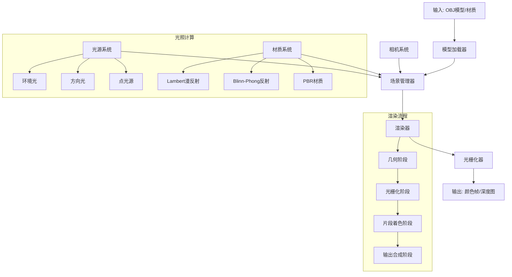

# Rasterizer_rust

一个使用Rust语言实现的高性能软件光栅化器，支持3D模型渲染、纹理映射、光照效果和基于物理的渲染(PBR)。

## 目录

- [项目概述](#项目概述)
- [主要功能](#主要功能)
- [安装与构建](#安装与构建)
- [使用指南](#使用指南)
  - [基本命令](#基本命令)
  - [命令行参数](#命令行参数)
  - [常用渲染场景](#常用渲染场景)
- [渲染架构](#渲染架构)
- [关键技术实现](#关键技术实现)
- [项目结构](#项目结构)
- [性能优化](#性能优化)
- [未来改进方向](#未来改进方向)
- [许可证](#许可证)

## 项目概述

本项目是一个从零开始实现的软件光栅化渲染器，无需依赖OpenGL等图形API，完全由CPU计算所有渲染步骤。渲染器利用Rust的安全性和并行计算能力，实现了高效的三角形光栅化、深度测试、光照计算、PBR材质系统和纹理映射等功能。

## 主要功能

- **3D模型加载**: 支持OBJ格式模型的加载和渲染
- **多种投影方式**: 支持透视投影和正交投影
- **光照模型**: 实现了环境光、方向光和点光源，以及Blinn-Phong着色模型
- **基于物理的渲染(PBR)**: 实现了基于金属度/粗糙度的PBR着色模型，可精确控制材质外观
- **纹理映射**: 支持图片纹理加载和UV映射
- **多种着色方式**: 支持平面着色(Flat Shading)、Phong着色(逐像素光照)和PBR着色
- **Z缓冲**: 实现了线程安全的深度测试
- **动画渲染**: 支持相机轨道动画生成
- **深度可视化**: 可输出深度图
- **多对象渲染**: 支持在同一场景中渲染多个对象实例
- **Gamma校正**: 实现了gamma校正以获得更准确的颜色显示
- **场景管理**: 支持多对象管理、实例化和变换
- **高性能计算**: 利用多线程并行处理提升渲染速度

## 安装与构建

### 环境要求

- Rust 1.55.0 或更高版本
- Cargo 包管理器
- FFmpeg (可选，用于生成视频)

### 安装依赖

```bash
# 安装Rust和Cargo (如果尚未安装)
curl --proto '=https' --tlsv1.2 -sSf https://sh.rustup.rs | sh

# 如需生成视频，请安装FFmpeg
# Ubuntu/Debian
sudo apt-get install ffmpeg
# macOS
brew install ffmpeg
```

### 构建项目

```bash
# 克隆项目
git clone https://github.com/yourusername/Rasterizer_rust.git
cd Rasterizer_rust

# 构建项目 (开发模式)
cargo build

# 构建项目 (发布模式，更高性能)
cargo build --release

# 或使用Makefile构建
make build
```

## 使用指南

### 基本命令

#### 使用Makefile运行(推荐)

```bash
# 渲染单帧图像（使用默认配置）
make run

# 渲染动画序列
make animate

# 从已渲染的动画序列生成视频
make video

# 渲染兔子模型轨道动画
make bunny_orbit

# 渲染带纹理的Spot模型轨道动画
make spot_orbit

# 渲染PBR材质演示
make pbr_rock

# 清理项目
make clean
```

#### 使用Cargo直接运行

```bash
# 基本渲染
cargo run --release -- --obj obj/bunny/bunny5k_f.obj

# 自定义参数渲染
cargo run --release -- --obj obj/models/spot/spot_triangulated.obj --use-phong --width 1024 --height 1024
```

### 命令行参数

下面是关键的命令行参数，按功能分类：

#### 输入/输出参数

| 参数 | 说明 | 默认值 |
|------|------|--------|
| `--obj` | 输入的OBJ模型文件路径 | (必需) |
| `--output` | 输出文件的基础名称 | "output" |
| `--output-dir` | 输出图像的目录 | "output_rust" |
| `--width` | 输出图像宽度 | 1024 |
| `--height` | 输出图像高度 | 1024 |

#### 相机参数

| 参数 | 说明 | 默认值 |
|------|------|--------|
| `--camera-from` | 相机位置，格式为"x,y,z" | "0,0,3" |
| `--camera-at` | 相机目标点，格式为"x,y,z" | "0,0,0" |
| `--camera-up` | 相机上方向，格式为"x,y,z" | "0,1,0" |
| `--camera-fov` | 相机视场角(度) | 45.0 |
| `--projection` | 投影类型: "perspective"或"orthographic" | "perspective" |

#### 光照参数

| 参数 | 说明 | 默认值 |
|------|------|--------|
| `--use-lighting` | 启用光照计算 | true |
| `--light-type` | 光源类型: "directional"或"point" | "directional" |
| `--light-dir` | 光源方向，格式为"x,y,z" | "0,-1,-1" |
| `--light-pos` | 点光源位置，格式为"x,y,z" | "0,5,5" |
| `--light-atten` | 点光源衰减因子，格式为"常数,线性,二次" | "1.0,0.09,0.032" |
| `--ambient` | 环境光强度 | 0.1 |
| `--ambient-color` | 环境光RGB值，格式为"r,g,b" | "0.1,0.1,0.1" |
| `--diffuse` | 漫反射光强度 | 0.8 |

#### 材质与着色参数

| 参数 | 说明 | 默认值 |
|------|------|--------|
| `--use-phong` | 使用Phong着色(逐像素光照) | false |
| `--use-pbr` | 使用基于物理的渲染 | false |
| `--use-texture` | 启用纹理加载和使用 | true |
| `--texture` | 显式指定纹理文件路径 | (无) |
| `--use-gamma` | 启用gamma矫正 | true |
| `--use-zbuffer` | 启用Z缓冲(深度测试) | true |
| `--save-depth` | 渲染并保存深度图 | true |
| `--colorize` | 使用伪随机面颜色而非材质颜色 | false |

#### PBR材质参数

| 参数 | 说明 | 默认值 |
|------|------|--------|
| `--metallic` | 材质金属度(0.0-1.0) | 0.0 |
| `--roughness` | 材质粗糙度(0.0-1.0) | 0.5 |
| `--base-color` | 材质基础颜色，格式为"r,g,b" | "0.8,0.8,0.8" |
| `--ambient-occlusion` | 环境光遮蔽系数(0.0-1.0) | 1.0 |
| `--emissive` | 材质自发光颜色，格式为"r,g,b" | "0.0,0.0,0.0" |

#### 动画与性能参数

| 参数 | 说明 | 默认值 |
|------|------|--------|
| `--animate` | 渲染动画序列而非单帧 | false |
| `--total-frames` | 动画的总帧数 | 120 |
| `--object-count` | 场景中创建的对象实例数量 | (无) |
| `--use-multithreading` | 启用多线程渲染 | true |
| `--backface-culling` | 启用背面剔除 | false |
| `--wireframe` | 以线框模式渲染 | false |
| `--cull-small-triangles` | 启用小三角形剔除 | false |
| `--min-triangle-area` | 小三角形剔除的最小面积阈值 | 1e-3 |

### 常用渲染场景

以下是一些预配置的渲染场景示例，展示了渲染器的各种功能：

#### 1. 基础渲染示例

```bash
# 使用默认设置渲染斯坦福兔子模型
make run

# 调整分辨率
make run WIDTH=1920 HEIGHT=1080

# 使用平面着色(默认)
make run USE_PHONG=false

# 使用Phong着色
make run USE_PHONG=true
```

#### 2. 光照效果

```bash
# 使用定向光(默认)
make run LIGHT_TYPE=directional LIGHT_DIR="0,-1,-1"

# 使用点光源
make run LIGHT_TYPE=point LIGHT_POS="2,3,2" LIGHT_ATTEN="1.0,0.05,0.01"

# 自定义环境光颜色
make run AMBIENT_COLOR="0.2,0.1,0.3"
```

#### 3. 带纹理的模型

```bash
# 渲染带纹理的Spot模型
make run OBJ_FILE=obj/models/spot/spot_triangulated.obj TEXTURE_FILE=obj/models/spot/spot_texture.png
```

#### 4. 基于物理的渲染(PBR)

```bash
# PBR金属材质
make run USE_PBR=true METALLIC=0.9 ROUGHNESS=0.1 BASE_COLOR="0.95,0.9,0.5"

# PBR非金属材质
make run USE_PBR=true METALLIC=0.0 ROUGHNESS=0.7 BASE_COLOR="0.2,0.5,0.8"

# 岩石PBR渲染(预配置)
make pbr_rock
```

#### 5. 动画渲染

```bash
# 渲染兔子模型的轨道动画
make bunny_orbit

# 渲染Spot模型的轨道动画
make spot_orbit
```

## 渲染架构

本渲染器遵循现代渲染引擎的架构设计，包含以下主要组件：



## 关键技术实现

### 1. 重心坐标插值

使用重心坐标进行顶点属性的插值，并实现了透视校正插值，确保纹理映射和其他属性在透视投影下的正确性：

```rust
pub fn interpolate_texcoords(
    bary: Vector3<f32>,
    tc1: Vector2<f32>,
    tc2: Vector2<f32>,
    tc3: Vector2<f32>,
    z1_view: f32,
    z2_view: f32,
    z3_view: f32,
    is_perspective: bool,
) -> Vector2<f32> {
    // 透视校正插值实现...
}
```

### 2. 光照计算

实现了Blinn-Phong光照模型和PBR材质系统，支持环境光、漫反射和镜面反射计算：

```rust
// Blinn-Phong 光照计算（在MaterialView实现中）
let diffuse = material.diffuse * n_dot_l;
let halfway_dir = (light_dir + view_dir).normalize();
let n_dot_h = normal.dot(&halfway_dir).max(0.0);
let spec_intensity = n_dot_h.powf(material.shininess);
let specular = material.specular * spec_intensity;
```

### 3. 线程安全的Z缓冲

使用原子操作确保多线程渲染时深度缓冲的一致性：

```rust
let current_depth_atomic = &depth_buffer[pixel_index];
let old_depth_before_update = current_depth_atomic
    .fetch_min(interpolated_depth, Ordering::Relaxed);
```

### 4. 并行三角形处理

使用Rayon库实现三角形并行光栅化，大幅提升渲染性能：

```rust
triangles_to_render.par_iter().for_each(|triangle_data| {
    rasterize_triangle(
        triangle_data,
        self.frame_buffer.width,
        self.frame_buffer.height,
        &self.frame_buffer.depth_buffer,
        &self.frame_buffer.color_buffer,
    );
});
```

### 5. 基于物理的渲染 (PBR)

实现了基于金属度/粗糙度工作流的简化版 PBR 渲染系统，提供更真实的材质表现：

```rust
// Material 结构体同时支持传统材质和PBR材质属性
pub struct Material {
    // --- 通用属性 ---
    pub name: String,
    pub dissolve: f32,
    
    // --- 传统Blinn-Phong属性 ---
    pub ambient: Vector3<f32>,
    pub diffuse: Vector3<f32>,
    pub specular: Vector3<f32>,
    pub shininess: f32,
    pub diffuse_texture: Option<Texture>,

    // --- PBR属性 ---
    pub base_color: Vector3<f32>,
    pub metallic: f32,
    pub roughness: f32,
    pub ambient_occlusion: f32,
    pub emissive: Vector3<f32>,
}

// Cook-Torrance BRDF 计算
let d = distribution_ggx(n_dot_h, roughness); // 法线分布函数
let f = fresnel_schlick(h_dot_v, f0);        // 菲涅耳项
let g = geometry_smith(n_dot_v, n_dot_l, roughness); // 几何遮蔽函数

// Cook-Torrance 镜面反射项
let specular = (d * g * f) / (4.0 * n_dot_v * n_dot_l).max(0.001);
```

## 项目结构

```bash
src/
├── main.rs       # 程序入口和命令行参数处理
├── args.rs       # 命令行参数定义
├── renderer.rs   # 渲染器核心，负责整体渲染流程
├── rasterizer.rs # 三角形光栅化实现
├── camera.rs     # 相机设置和矩阵计算
├── scene.rs      # 场景管理系统
├── scene_object.rs # 场景对象定义和变换
├── material_system.rs # 材质系统和光照实现
├── texture_utils.rs # 纹理加载和采样
├── color_utils.rs # 颜色处理工具
├── interpolation.rs # 属性插值功能
├── transform.rs  # 坐标变换函数
├── loaders.rs    # OBJ模型和材质加载
├── model_types.rs # 模型数据结构定义
└── utils.rs      # 通用工具函数
```

## 性能优化

本渲染器采用了多种性能优化策略：

1. **多线程渲染**：使用Rayon库实现三角形并行光栅化
2. **早期剔除**：实现三角形剔除，跳过不可见的三角形
3. **边界检查优化**：使用包围盒减少像素处理量
4. **深度测试优化**：使用原子操作提高多线程下深度测试性能
5. **缓存友好的数据结构**：设计考虑内存访问模式的数据结构，提高缓存命中率

## 未来改进方向

- 优化深度缓冲区的并行访问性能
- 实现更多高级材质模型和参数
- 添加更多的图元支持(点、线)
- 实现层次包围盒加速三角形遍历
- 添加后处理效果如抗锯齿、景深等
- 添加阴影映射支持
- 实现简单的实时编辑器界面
- 添加骨骼动画支持
- 实现更多的光照技术如环境光遮蔽(AO)

## 许可证

本项目采用 MIT 许可证。详见 [LICENSE](LICENSE) 文件。
