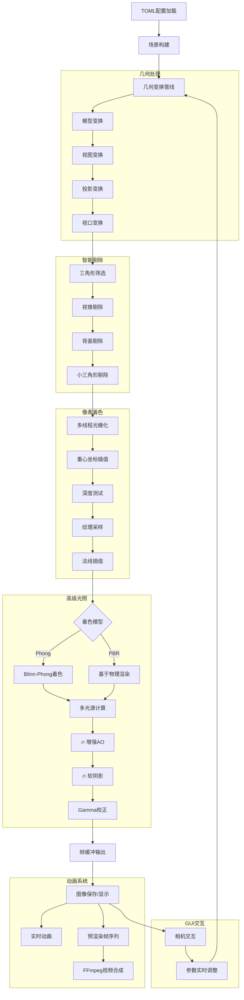

# Rust 高性能光栅化渲染器 v2.0 🎨

一个功能完备的软件光栅化渲染器，采用**TOML驱动配置**和**现代化GUI界面**。支持从基础几何渲染到高级PBR材质、多光源系统、实时相机交互、配置文件管理等专业级渲染功能。

[](https://www.rust-lang.org/)
[](https://opensource.org/licenses/MIT)
[](https://github.com/Rukkhadevata123/Rasterizer_rust)

## 🔥 v2.0 核心特性

### 📝 **TOML 配置驱动**

- **完整的TOML配置支持** - 所有渲染参数均可通过配置文件设置
- **配置文件管理** - 一键加载/保存配置，示例配置生成
- **参数验证系统** - 智能检测并提示配置错误
- **向后兼容** - CLI参数与TOML配置无缝集成

### 🖥️ **现代化GUI界面**

- **专业级相机交互** - 鼠标拖拽、Shift+轨道旋转、滚轮缩放
- **实时参数调整** - 所见即所得的参数编辑体验
- **多面板设计** - 文件管理、渲染设置、材质调整、动画控制
- **中文界面支持** - 完整的本地化用户界面

### ⚡ **高性能渲染引擎**

- **多线程光栅化** - 充分利用现代多核CPU性能
- **智能剔除系统** - 背面剔除、视锥剔除、小三角形剔除
- **增强AO算法** - 基于法线、边缘、曲率的高级环境光遮蔽
- **软阴影效果** - 多光源软阴影，可调强度控制

### 🎬 **动画与视频系统**

- **实时动画渲染** - 支持相机轨道和物体旋转动画
- **预渲染模式** - 预计算帧序列，确保流畅播放
- **视频生成** - 集成FFmpeg，一键生成MP4动画
- **帧率统计** - 实时FPS监控和性能分析

## 目录

- [安装与构建](#安装与构建)
- [快速开始](#快速开始)
- [配置文件详解](#配置文件详解)
- [GUI使用指南](#gui使用指南)
- [命令行模式](#命令行模式)
- [渲染管线](#渲染管线)
- [项目架构](#项目架构)
- [示例与教程](#示例与教程)

## 安装与构建

### 环境要求

- **Rust**: 1.81+ (推荐最新稳定版)
- **依赖库**: 自动通过Cargo管理
- **FFmpeg**: (可选) 用于视频生成功能

#### 安装FFmpeg

**Windows**:

```powershell
# 使用Chocolatey
choco install ffmpeg

# 使用Winget
winget install Gyan.FFmpeg

# 或从官网下载并添加到PATH
# https://ffmpeg.org/download.html
```

**macOS**:

```bash
brew install ffmpeg
```

**Ubuntu/Debian**:

```bash
sudo apt-get update
sudo apt-get install ffmpeg libxcb-render0-dev libxcb-shape0-dev libxcb-xfixes0-dev libxkbcommon-dev libssl-dev pkg-config
```

### 构建步骤

```bash
# 1. 克隆项目
git clone https://github.com/Rukkhadevata123/Rasterizer_rust
cd Rasterizer_rust

# 2. 构建 (开发模式)
cargo build

# 3. 构建 (发布模式，推荐)
cargo build --release

# 4. 运行
cargo run --release
```

## 快速开始

### 🚀 GUI模式 (推荐)

```bash
# 启动GUI (默认配置)
cargo run --release

# 从配置文件启动GUI
cargo run --release -- --config my_config.toml

# 使用示例配置启动GUI
cargo run --release -- --use-example-config
```

### ⚡ 命令行模式

```bash
# 生成示例配置文件
cargo run --release -- --use-example-config --headless

# 使用配置文件进行无头渲染
cargo run --release -- --config example_config.toml --headless
```

## 配置文件详解

### 基础配置结构

```toml
# config.toml - 完整配置示例

[files]
obj = "obj/models/spot/spot_triangulated.obj"
output = "my_render"
output_dir = "output"
texture = "obj/models/spot/spot_texture.png"          # 可选
background_image = "backgrounds/skybox.jpg"           # 可选

[render]
width = 1920
height = 1080
projection = "perspective"                             # "perspective" | "orthographic"
use_zbuffer = true
use_texture = true
use_gamma = true
backface_culling = true
enhanced_ao = true                                     # 🔥 增强环境光遮蔽
soft_shadows = true                                    # 🔥 软阴影效果

[camera]
from = "2.5,1.5,4.0"                                  # 相机位置
at = "0,0.5,0"                                        # 观察目标
up = "0,1,0"                                          # 上方向
fov = 60.0                                            # 视场角(度)

[object]
position = "0,0.2,0"                                  # 物体位置
rotation = "15,30,0"                                  # 旋转角度(度)
scale_xyz = "1.2,1.0,1.2"                           # 非均匀缩放
scale = 1.5                                           # 全局缩放

[lighting]
use_lighting = true
ambient = 0.2                                         # 环境光强度
ambient_color = "0.2,0.3,0.4"                       # 环境光颜色

# 🔥 多光源配置 - 支持任意数量的光源
[[light]]
type = "directional"
enabled = true
direction = "0.3,-0.8,-0.5"
color = "1.0,0.95,0.8"
intensity = 0.8

[[light]]
type = "point"
enabled = true
position = "2.0,3.0,2.0"
color = "1.0,0.8,0.6"
intensity = 2.5
constant_attenuation = 1.0
linear_attenuation = 0.09
quadratic_attenuation = 0.032

[material]
use_phong = true                                      # Phong着色
use_pbr = false                                       # PBR着色
# Phong参数
diffuse_color = "0.7,0.5,0.3"
specular = 0.8
shininess = 64.0
# PBR参数
base_color = "0.8,0.6,0.4"
metallic = 0.1
roughness = 0.3
# 增强效果参数
enhanced_ao = true
ao_strength = 0.6                                     # AO强度
soft_shadows = true
shadow_strength = 0.8                                 # 阴影强度

[background]
use_background_image = false
enable_gradient_background = true                      # 渐变背景
gradient_top_color = "0.3,0.5,0.8"
gradient_bottom_color = "0.8,0.6,0.4"
enable_ground_plane = true                            # 地面平面
ground_plane_color = "0.4,0.6,0.3"
ground_plane_height = -0.5

[animation]
animate = false                                       # CLI动画模式
fps = 60                                             # 视频帧率
rotation_speed = 0.8                                 # 实时渲染速度
rotation_cycles = 2.0                                # 视频旋转圈数
animation_type = "CameraOrbit"                       # "CameraOrbit" | "ObjectLocalRotation" | "None"
rotation_axis = "Y"                                  # "X" | "Y" | "Z" | "Custom"
custom_rotation_axis = "0.2,1,0.3"                  # 自定义轴(当rotation_axis="Custom")
```

### 快速配置模板

```bash
# 生成基础配置模板
cargo run --release -- --use-example-config

# 编辑配置文件
# 根据需要修改 temp_example_config.toml

# 使用配置文件启动
cargo run --release -- --config temp_example_config.toml
```

## GUI使用指南

### 界面布局

```
┌─────────────────────────────────────────────────────────────┐
│ 🏠 光栅化渲染器 | 状态信息 | FPS显示 | Ctrl+R: 快速渲染    │
├──────────────┬──────────────────────────────────────────────┤
│              │                                              │
│ 🎛️ 控制面板    │           🖼️ 渲染结果显示区域                │
│              │                                              │
│ 📁 文件设置     │           🖱️ 相机交互区域                   │
│ 🎨 渲染设置     │                                              │
│ 🔧 物体变换     │           右下角: 交互提示面板               │
│ 📷 相机设置     │                                              │
│ 💡 光照设置     │                                              │
│ 🎭 材质设置     │                                              │
│ 🎬 动画设置     │                                              │
│ 🔴 渲染按钮     │                                              │
└──────────────┴──────────────────────────────────────────────┘
```

### 🔥 配置文件管理

在"文件与输出设置"面板中：

- **📁 加载配置** - 从.toml文件加载完整配置
- **💾 保存配置** - 将当前设置保存为.toml文件
- **📋 示例配置** - 快速应用内置示例配置

```
┌─────────────────────────────────────────┐
│ 文件与输出设置                            │
├─────────────────────────────────────────┤
│ OBJ文件: [path/to/model.obj] [浏览...]   │
│ ━━━━━━━━━━━━━━━━━━━━━━━━━━━━━━━━━━━━━━━━━ │
│ 配置文件: [📁加载配置] [💾保存配置] [📋示例] │
│ 💡 提示：加载配置会覆盖当前所有设置       │
└─────────────────────────────────────────┘
```

### 🖱️ 相机交互系统

在中央渲染区域进行3D导航：

| 操作 | 功能 |
|------|------|
| **鼠标拖拽** | 平移相机视角 |
| **Shift + 拖拽** | 围绕目标轨道旋转 |
| **鼠标滚轮** | 推拉缩放 |
| **R键** | 重置到默认视角 |
| **F键** | 聚焦到物体中心 |

**敏感度调节**: 在"相机设置"面板中可独立调整平移、旋转、缩放的响应速度。

### 🎬 动画渲染模式

#### 实时动画渲染

```
[开始动画渲染] 按钮 → 立即开始旋转动画
├── 显示实时FPS统计
├── 支持相机交互调整观察角度  
├── 可调节旋转速度
└── [停止动画渲染] 停止播放
```

#### 预渲染模式

```
☑️ 启用预渲染模式 → [开始动画渲染]
├── 首次: 预先计算所有帧 (显示进度)
├── 完成后: 流畅播放预渲染帧
├── 适合复杂场景和高质量预览
└── 占用更多内存，但播放无卡顿
```

### 🎥 视频生成工作流

1. **配置参数**: 在"动画设置"中调整fps、旋转圈数、动画类型
2. **预览效果**: 使用实时动画渲染预览效果
3. **生成视频**: 点击"生成视频"按钮，后台渲染并合成MP4
4. **进度监控**: 状态栏显示渲染进度和预计时间

## 命令行模式

### CLI 参数总览

```bash
cargo run --release -- [OPTIONS]

OPTIONS:
    -c, --config <FILE>        📁 指定TOML配置文件路径
        --headless             🚀 无头模式(不启动GUI)
        --use-example-config   📋 使用示例配置
    -h, --help                 显示帮助信息
```

### 使用场景

#### 🔧 配置文件开发

```bash
# 1. 生成示例配置
cargo run --release -- --use-example-config

# 2. 编辑配置文件
notepad temp_example_config.toml  # Windows
# 或
vim temp_example_config.toml      # Linux/macOS

# 3. 测试配置 (GUI模式)
cargo run --release -- --config temp_example_config.toml

# 4. 无头批量渲染
cargo run --release -- --config temp_example_config.toml --headless
```

#### 🤖 自动化渲染

```bash
# 批量处理多个配置
for config in configs/*.toml; do
    cargo run --release -- --config "$config" --headless
done
```

#### 🐳 容器化部署

```dockerfile
# Dockerfile示例
FROM rust:1.81
COPY . /app
WORKDIR /app
RUN cargo build --release
CMD ["./target/release/rasterizer", "--config", "production.toml", "--headless"]
```

## 渲染管线



## 项目架构

```
src/
├── 🏗️ core/                    # 核心渲染引擎
│   ├── frame_buffer.rs         # 帧缓冲区与背景管理
│   ├── geometry_processor.rs   # 几何变换处理器
│   ├── renderer.rs            # 主渲染器协调
│   ├── triangle_processor.rs  # 三角形处理与准备
│   ├── parallel_rasterizer.rs # 🔥 智能并行光栅化器
│   ├── rasterizer/            # 🔥 模块化光栅化系统
│   │   ├── mod.rs             # 模块导出
│   │   ├── triangle_data.rs   # 核心数据结构
│   │   ├── pixel_processor.rs # 像素处理核心
│   │   ├── color_calculator.rs# 颜色计算算法
│   │   ├── texture_sampler.rs # 纹理采样系统
│   │   └── lighting_effects.rs# 光照效果计算
│   └── mod.rs                 # 核心模块导出
├── 📐 geometry/                # 几何处理模块  
│   ├── camera.rs              # 专业相机系统
│   ├── transform.rs           # 几何变换矩阵
│   ├── culling.rs             # 智能剔除算法
│   └── interpolation.rs       # 插值算法
├── 📁 io/                      # 🔥 配置与IO系统
│   ├── config_loader.rs       # TOML配置管理器
│   ├── simple_cli.rs          # 极简CLI处理
│   ├── render_settings.rs     # 统一配置数据结构
│   └── model_loader.rs        # 模型资源加载
├── 💡 material_system/         # 材质与光照
│   ├── light.rs               # 多光源系统
│   ├── materials.rs           # Phong/PBR材质
│   ├── texture.rs             # 纹理管理
│   └── color.rs               # 颜色处理
├── 🎬 scene/                   # 场景管理
│   ├── scene_utils.rs         # 场景构建与统计
│   └── scene_object.rs        # 场景对象变换
├── 🖥️ ui/                      # 现代化GUI界面
│   ├── app.rs                 # eframe应用主逻辑
│   ├── widgets.rs             # 自定义UI组件
│   ├── render_ui.rs           # 文件选择与配置管理
│   ├── core.rs                # GUI核心方法
│   └── animation.rs           # 动画控制逻辑
├── 🛠️ utils/                   # 工具函数库
│   ├── render_utils.rs        # 渲染辅助函数
│   ├── model_utils.rs         # 模型处理工具
│   └── save_utils.rs          # 文件保存工具
└── main.rs                    # 程序入口点
```

### 🔥 v2.0 架构亮点

- **🎯 配置驱动架构**: `RenderSettings`作为单一数据源，CLI/GUI/TOML三者统一
- **📦 模块化设计**: 光栅化器拆分为多个专职模块，便于维护和扩展
- **⚡ 智能并行渲染**: 自动选择最优并行策略，无需手动配置
- **🔄 实时交互**: GUI参数变化立即反映到渲染结果
- **💾 状态管理**: 统一的错误处理、进度监控、资源清理

## 示例与教程

### 📚 基础渲染示例

#### 简单模型渲染

```bash
# 1. 创建基础配置
cargo run --release -- --use-example-config

# 2. 编辑配置 - 设置自己的模型
[files]
obj = "path/to/your/model.obj"
output = "my_first_render"

# 3. GUI模式渲染
cargo run --release -- --config temp_example_config.toml
```

#### PBR材质展示

```toml
[material]
use_pbr = true
base_color = "0.9,0.7,0.5"      # 金属基色
metallic = 0.8                   # 高金属度
roughness = 0.2                  # 低粗糙度(光滑)
enhanced_ao = true
ao_strength = 0.7

[[light]]
type = "directional"
direction = "0.2,-1.0,-0.3"
color = "1.0,0.9,0.8"            # 暖色调主光
intensity = 1.2

[[light]]
type = "point"
position = "3.0,2.0,3.0"
color = "0.6,0.8,1.0"            # 冷色调补光
intensity = 0.8
```

### 🎬 动画制作工作流

#### 相机轨道动画

```toml
[animation]
animation_type = "CameraOrbit"
rotation_axis = "Y"
rotation_cycles = 1.0            # 完整一圈
fps = 30                         # 30fps视频

[camera]
from = "3.0,1.0,3.0"            # 起始位置
at = "0,0.5,0"                  # 观察中心
```

**操作流程**:

1. 在GUI中点击"开始动画渲染"预览效果
2. 调整相机位置和旋转速度
3. 启用预渲染模式进行高质量预览
4. 满意后点击"生成视频"导出MP4

#### 物体旋转展示

```toml
[animation]
animation_type = "ObjectLocalRotation"
rotation_axis = "Custom"
custom_rotation_axis = "0.3,1.0,0.2"  # 倾斜轴旋转
rotation_cycles = 2.0                   # 两圈展示

[object]
position = "0,0,0"
scale = 1.5                            # 放大展示
```

### 🏭 生产环境配置

#### 高质量静态渲染

```toml
[render]
width = 3840                     # 4K分辨率
height = 2160
enhanced_ao = true
ao_strength = 0.8
soft_shadows = true
shadow_strength = 0.6

[lighting]
ambient = 0.15                   # 适中环境光

# 三点布光设置
[[light]]
type = "directional"             # 主光源
direction = "0.3,-0.8,-0.5"
intensity = 1.0

[[light]]
type = "point"                   # 补光源
position = "-2.0,1.5,2.0"
intensity = 0.6

[[light]]
type = "point"                   # 轮廓光
position = "1.5,0.5,-2.0"
intensity = 0.4
```

#### 批量渲染脚本

```bash
#!/bin/bash
# batch_render.sh

models_dir="assets/models"
output_dir="rendered_images"
config_template="templates/high_quality.toml"

for model_file in "$models_dir"/*.obj; do
    model_name=$(basename "$model_file" .obj)
    
    # 复制配置模板
    config_file="temp_${model_name}_config.toml"
    cp "$config_template" "$config_file"
    
    # 修改配置中的模型路径
    sed -i "s|PLACEHOLDER_MODEL|$model_file|g" "$config_file"
    sed -i "s|PLACEHOLDER_OUTPUT|$model_name|g" "$config_file"
    
    # 无头渲染
    cargo run --release -- --config "$config_file" --headless
    
    # 清理临时配置
    rm "$config_file"
    
    echo "✅ 完成渲染: $model_name"
done

echo "🎉 批量渲染完成！"
```

## 性能优化建议

### 💻 硬件配置

- **CPU**: 推荐8核心以上，受益于多线程光栅化
- **内存**: 16GB+，支持大模型和预渲染缓存
- **存储**: SSD优先，加速纹理和模型加载

### ⚙️ 渲染设置优化

#### 高性能设置

```toml
[render]
cull_small_triangles = true      # 剔除小三角形
min_triangle_area = 0.001       # 剔除阈值
backface_culling = true         # 背面剔除
```

#### 高质量设置

```toml
[render]
enhanced_ao = true
ao_strength = 0.8
soft_shadows = true
shadow_strength = 0.6
use_gamma = true                # Gamma校正
```

#### 平衡设置

```toml
[render]
enhanced_ao = true
ao_strength = 0.5               # 适中AO强度
soft_shadows = true  
shadow_strength = 0.4           # 适中阴影强度
cull_small_triangles = true
```

## 故障排除

### 常见问题

#### 🔧 编译问题

```bash
# 确保Rust版本
rustc --version  # 应为1.81+

# 清理重新构建
cargo clean
cargo build --release
```

#### 📁 文件加载问题

```bash
# 检查文件路径
ls -la obj/models/        # Linux/macOS
dir obj\models\           # Windows

# 验证文件格式
file model.obj            # 应显示ASCII text
```

#### 🎥 视频生成问题

```bash
# 检查FFmpeg
ffmpeg -version

# Windows安装FFmpeg
choco install ffmpeg

# 检查输出目录权限
ls -la output_directory/
```

#### 🖱️ 相机交互无响应

- 确保在**中央渲染区域**操作，不是左侧面板
- 首先进行一次渲染，生成图像后才能交互
- 检查鼠标是否在图像区域内

### 📊 性能分析

#### 内存使用

```bash
# 查看内存占用
top -p $(pgrep rasterizer)    # Linux
# 或在任务管理器中查看        # Windows
```

#### 渲染性能

```toml
# 在GUI中启用FPS显示
# 实时动画渲染时查看右上角FPS统计
# 目标: 
# - 简单场景: 30+ FPS
# - 复杂场景: 15+ FPS  
# - 高质量渲染: 5+ FPS
```

## 贡献指南

### 🛠️ 开发环境搭建

```bash
# 1. Fork项目
git clone https://github.com/Rukkhadevata123/Rasterizer_rust
cd Rasterizer_rust

# 2. 创建开发分支
git checkout -b feature/your-feature-name

# 3. 安装开发依赖
cargo install cargo-clippy cargo-fmt

# 4. 运行测试
cargo test
cargo clippy
cargo fmt
```

### 📝 代码规范

- **Rust风格**: 遵循官方Rust代码规范
- **注释语言**: 中文注释，英文变量名
- **提交信息**: 使用约定式提交格式
- **测试覆盖**: 新功能需要相应测试

### 🔍 测试配置

```toml
# tests/test_config.toml - 单元测试配置
[files]
obj = "tests/assets/cube.obj"
output = "test_output"

[render]
width = 256
height = 256
```

## 版本历史

### 🎉 v2.0.0 (Current)

- ✨ **全新TOML配置系统**
- 🖥️ **现代化GUI界面重构**  
- 📁 **配置文件管理功能**
- 🔥 **增强AO和软阴影算法**
- 🎬 **预渲染动画系统**
- 🖱️ **专业级相机交互**

### v1.x Legacy

- 基础光栅化渲染器
- CLI参数配置
- Phong/PBR着色模型
- 多线程渲染支持

## 许可证

本项目采用 MIT 许可证。详见 [LICENSE](LICENSE) 文件。

## 致谢

- **egui**: 现代化Rust GUI框架
- **nalgebra**: 高性能线性代数库
- **image**: 图像处理库
- **toml**: TOML配置解析
- **clap**: CLI参数解析

---

<div align="center">

**🎨 用Rust重新定义软件光栅化渲染 🎨**

[🔗 GitHub仓库](https://github.com/Rukkhadevata123/Rasterizer_rust) | [📚 文档](README.md) | [🐛 问题反馈](https://github.com/Rukkhadevata123/Rasterizer_rust/issues)

</div>
