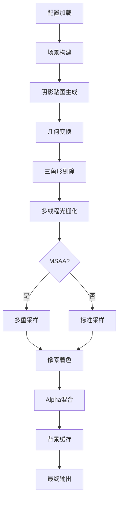

# Rust 高性能光栅化渲染器 v2.6 🎨

一个功能完备的软件光栅化渲染器，采用**TOML驱动配置**和**现代化GUI界面**。支持从基础几何渲染到高级PBR材质系统、多重采样抗锯齿、真实Alpha透明度渲染、智能背景缓存、阴影映射等专业级渲染功能。

[](https://www.rust-lang.org/)
[](https://opensource.org/licenses/MIT)
[](https://github.com/Rukkhadevata123/Rasterizer_rust)

## 🔥 核心特性

### 🎨 **高质量渲染**

- **MSAA抗锯齿** - 1x/2x/4x/8x多重采样，消除锯齿
- **PBR材质系统** - 次表面散射、各向异性、法线强度控制
- **真实Alpha透明度** - 与背景图片、渐变的真实混合
- **增强光照** - 多光源、软阴影、环境光遮蔽、地面阴影映射

### ⚡ **性能优化**

- **智能背景缓存** - 背景和地面预计算，50-80%性能提升
- **多线程光栅化** - 充分利用现代多核CPU
- **智能剔除** - 背面剔除、视锥剔除、小三角形剔除

### 🖥️ **现代化界面**

- **GUI实时控制** - 专业级相机交互，所见即所得参数调整
- **TOML配置驱动** - 完整配置文件支持，一键保存/加载
- **动画系统** - 实时渲染和视频生成

## 安装与构建

### 环境要求

- **Rust**: 1.81+ (推荐最新稳定版)
- **FFmpeg**: (可选) 用于视频生成

```bash
# 克隆并构建
git clone https://github.com/Rukkhadevata123/Rasterizer_rust
cd Rasterizer_rust
cargo build --release

# 运行GUI
cargo run --release

# 生成示例配置
cargo run --release -- --use-example-config
```

## 配置文件详解

```toml
# config.toml - 完整配置示例

[files]
obj = "obj/models/spot/spot_triangulated.obj"
output = "my_render"
texture = "obj/models/spot/spot_texture.png"          # 可选
background_image = "backgrounds/skybox.jpg"           # 可选

[render]
width = 1920
height = 1080
projection = "perspective"                             # "perspective" | "orthographic"
use_zbuffer = true
use_texture = true
use_gamma = true
backface_culling = true
msaa_samples = 4                                       # MSAA级别 (1/2/4/8)

[camera]
from = "2.5,1.5,4.0"                                  # 相机位置
at = "0,0.5,0"                                        # 观察目标
up = "0,1,0"                                          # 上方向
fov = 60.0                                            # 视场角(度)

[object]
position = "0,0.2,0"                                  # 物体位置
rotation = "15,30,0"                                  # 旋转角度(度)
scale = 1.5                                           # 缩放

[lighting]
use_lighting = true
ambient = 0.2                                         # 环境光强度
ambient_color = "0.2,0.3,0.4"                       # 环境光颜色

# 多光源配置
[[light]]
type = "directional"
enabled = true
direction = "0.3,-0.8,-0.5"
color = "1.0,0.95,0.8"
intensity = 0.8

[[light]]
type = "point"
enabled = true
position = "2.0,3.0,2.0"
color = "1.0,0.8,0.6"
intensity = 2.5
constant_attenuation = 1.0
linear_attenuation = 0.09
quadratic_attenuation = 0.032

[material]
use_pbr = true                                        # 推荐使用PBR
alpha = 0.75                                         # 透明度 (0.0-1.0)
emissive = "0.0,0.0,0.0"                            # 自发光颜色

# PBR参数
base_color = "0.85,0.7,0.6"                         # 基础颜色
metallic = 0.0                                       # 金属度 (0.0-1.0)
roughness = 0.6                                      # 粗糙度 (0.0-1.0)
subsurface = 0.7                                     # 次表面散射强度
anisotropy = 0.0                                     # 各向异性 (-1.0 到 1.0)
normal_intensity = 0.8                               # 法线强度 (0.0-2.0)

# Phong参数 (当use_pbr = false时)
diffuse_color = "0.7,0.5,0.3"
diffuse_intensity = 1.2
specular_color = "0.9,0.8,0.7"
specular_intensity = 0.8
shininess = 64.0

[shadow]
# === 环境光遮蔽 ===
enhanced_ao = true                                    # 增强环境光遮蔽
ao_strength = 0.5                                    # AO强度 (0.0-1.0)

# === 软阴影 ===
soft_shadows = true                                  # 软阴影
shadow_strength = 0.7                               # 软阴影强度 (0.0-1.0)

# === 阴影映射 (地面阴影) ===
enable_shadow_mapping = true                         # 启用地面阴影映射
shadow_map_size = 512                               # 阴影贴图尺寸 (128/256/512/1024/2048/4096)
shadow_bias = 0.001                                 # 阴影偏移
shadow_distance = 20.0                              # 阴影距离

[background]
use_background_image = false
enable_gradient_background = true                      # 渐变背景
gradient_top_color = "0.3,0.5,0.8"
gradient_bottom_color = "0.8,0.6,0.4"
enable_ground_plane = true                            # 地面平面
ground_plane_color = "0.4,0.6,0.3"
ground_plane_height = -0.5                           # 自动适配按钮可智能计算

[animation]
animate = false                                       # CLI动画模式
fps = 60                                             # 视频帧率
rotation_speed = 0.8                                 # 实时渲染速度
animation_type = "CameraOrbit"                       # "CameraOrbit" | "ObjectLocalRotation"
rotation_axis = "Y"                                  # "X" | "Y" | "Z" | "Custom"
```

## 命令行模式

```bash
# 基础用法
cargo run --release -- [OPTIONS]

# 主要选项
-c, --config <FILE>        # 指定TOML配置文件
    --headless             # 无头模式(不启动GUI)
    --use-example-config   # 使用示例配置

# 示例
cargo run --release -- --config my_config.toml
cargo run --release -- --config example.toml --headless
```

## 性能设置指南

### 高性能设置

```toml
[render]
msaa_samples = 1                    # 关闭抗锯齿

[shadow]
enhanced_ao = false
soft_shadows = false
enable_shadow_mapping = false       # 关闭阴影映射

[material]
alpha = 1.0                         # 禁用透明度
subsurface = 0.0                    # 禁用次表面散射
```

### 平衡设置 (推荐)

```toml
[render]
msaa_samples = 4                    # 4x MSAA抗锯齿

[shadow]
enhanced_ao = true
soft_shadows = true
enable_shadow_mapping = true        # 启用地面阴影
shadow_map_size = 256              # 中等质量阴影

[material]
alpha = 0.8                         # 轻微透明度
subsurface = 0.3                    # 轻微次表面散射
```

### 高质量设置

```toml
[render]
msaa_samples = 8                    # 8x MSAA最高质量

[shadow]
enhanced_ao = true
soft_shadows = true
enable_shadow_mapping = true        # 启用地面阴影
shadow_map_size = 1024             # 高质量阴影

[material]
subsurface = 0.6                    # 启用次表面散射
anisotropy = 0.4                    # 适度各向异性
```

## 渲染管线



## 项目架构

```
src/
├── core/                           # 核心渲染引擎
│   ├── frame_buffer.rs            # 智能背景缓存系统
│   ├── geometry_processor.rs      # 几何处理器
│   ├── parallel_rasterizer.rs     # 并行光栅化器
│   ├── renderer.rs                # 主渲染器
│   ├── simple_shadow_map.rs       # 地面阴影映射
│   ├── triangle_processor.rs      # 三角形处理器
│   └── rasterizer/                # 模块化光栅化
│       ├── msaa.rs               # MSAA抗锯齿模块
│       ├── pixel_processor.rs    # 像素处理器
│       ├── shading.rs            # 着色与Alpha混合
│       └── triangle_data.rs      # 三角形数据结构
├── geometry/                      # 几何处理模块
│   ├── camera.rs                 # 相机系统
│   ├── culling.rs                # 几何剔除
│   ├── interpolation.rs          # 插值算法
│   └── transform.rs              # 变换工厂
├── io/                           # 配置与IO系统
│   ├── config_loader.rs          # TOML配置管理
│   ├── model_loader.rs           # 统一模型加载器
│   ├── obj_loader.rs             # OBJ文件解析器
│   ├── render_settings.rs        # 统一配置+MSAA支持
│   └── simple_cli.rs             # 简化CLI接口
├── material_system/              # 材质与光照
│   ├── color.rs                  # 颜色系统
│   ├── light.rs                  # 光源系统
│   ├── materials.rs              # 材质系统
│   └── texture.rs                # 纹理管理
├── scene/                        # 场景管理
│   ├── scene_object.rs           # 场景对象
│   └── scene_utils.rs            # 场景工具
├── ui/                           # 现代化GUI界面
│   ├── animation.rs              # 动画控制
│   ├── app.rs                    # 主应用程序
│   ├── core.rs                   # 核心UI组件
│   ├── render_ui.rs              # 渲染参数UI
│   └── widgets.rs                # 自定义组件
├── utils/                        # 工具模块
│   ├── model_utils.rs            # 模型处理工具
│   ├── render_utils.rs           # 渲染工具
│   └── save_utils.rs             # 文件保存工具
└── main.rs                       # 程序入口
```

## 故障排除

### 常见问题

**编译问题**:

```bash
rustc --version  # 确保1.81+
cargo clean && cargo build --release
```

**MSAA效果不明显**: 确保`msaa_samples > 1`，检查模型边缘清晰度

**透明度效果不明显**: 确保有背景设置，检查`alpha < 1.0`

**阴影效果不显示**: 需要启用地面平面和方向光源，检查`enable_shadow_mapping = true`

**性能问题**: 降低MSAA级别和阴影贴图尺寸，关闭次表面散射和透明度

## 版本历史

- **v2.6.0** - 地面阴影映射，智能地面高度适配，场景边界计算优化
- **v2.5.0** - MSAA多重采样抗锯齿，渲染管线优化
- **v2.4.0** - 智能背景缓存系统，背景和地面预计算优化
- **v2.3.0** - 真实Alpha透明度渲染，材质系统UI重构
- **v2.2.0** - 增强PBR材质系统，次表面散射，各向异性
- **v2.0.0** - TOML配置系统，现代化GUI界面

## 许可证

本项目采用 MIT 许可证。详见 [LICENSE](LICENSE) 文件。

## 致谢

- **egui**: 现代化Rust GUI框架
- **nalgebra**: 高性能线性代数库  
- **image**: 图像处理库
- **toml**: TOML配置解析

---

<div align="center">

**🎨 用Rust重新定义软件光栅化渲染 🎨**

[🔗 GitHub仓库](https://github.com/Rukkhadevata123/Rasterizer_rust) | [🐛 问题反馈](https://github.com/Rukkhadevata123/Rasterizer_rust/issues)

</div>
