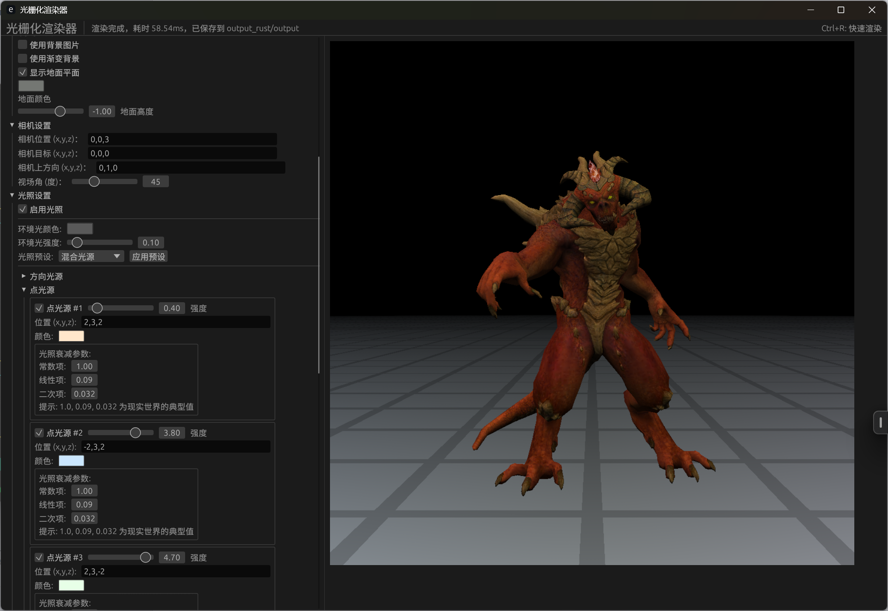

# Rust 高性能光栅化渲染器 (GUI版)

一个使用Rust语言从零开始实现的软件光栅化渲染器。它利用CPU进行所有渲染计算，支持3D模型加载、多种投影方式、复杂光照模型（包括Blinn-Phong和PBR）、纹理映射、动画生成以及一个基于egui的交互式图形用户界面（GUI）。

## 目录

- [Rust 高性能光栅化渲染器 (GUI版)](#rust-高性能光栅化渲染器-gui版)
  - [目录](#目录)
  - [核心功能](#核心功能)
  - [图形用户界面 (GUI)](#图形用户界面-gui)
  - [渲染管线](#渲染管线)
  - [安装与构建](#安装与构建)
    - [环境要求](#环境要求)
    - [构建步骤](#构建步骤)
  - [使用指南](#使用指南)
    - [GUI 模式](#gui-模式)
    - [命令行模式 (CLI)](#命令行模式-cli)
    - [命令行参数详解](#命令行参数详解)
      - [文件与输出设置](#文件与输出设置)
      - [渲染属性设置](#渲染属性设置)
      - [背景与环境设置](#背景与环境设置)
      - [相机设置](#相机设置)
      - [光照设置](#光照设置)
      - [PBR材质设置 (Physical Based Rendering)](#pbr材质设置-physical-based-rendering)
      - [Phong材质设置 (Blinn-Phong 着色)](#phong材质设置-blinn-phong-着色)
      - [动画设置](#动画设置)
    - [命令行示例](#命令行示例)
      - [1. 基础渲染 (斯坦福兔子)](#1-基础渲染-斯坦福兔子)
      - [2. 带纹理的模型渲染 (Spot)](#2-带纹理的模型渲染-spot)
      - [3. PBR 渲染 (岩石模型)](#3-pbr-渲染-岩石模型)
      - [4. 生成动画序列 (相机轨道)](#4-生成动画序列-相机轨道)
  - [项目架构 (简述)](#项目架构-简述)
  - [未来展望](#未来展望)
  - [许可证](#许可证)

## 核心功能

- **交互式GUI**：基于 `egui` 实现，支持实时参数调整和渲染预览。
- **3D模型加载**：支持 `.obj` 格式模型。
- **投影方式**：支持透视投影和正交投影。
- **光照与着色**：
  - Blinn-Phong 光照模型。
  - 基于物理的渲染 (PBR) 工作流 (金属度/粗糙度)。
  - 支持环境光、方向光、点光源（带衰减）。
- **材质系统**：
  - 支持漫反射颜色、镜面反射强度、光泽度 (Phong)。
  - 支持基础颜色、金属度、粗糙度、环境光遮蔽、自发光 (PBR)。
  - 统一处理图像纹理、随机面颜色、以及材质定义的颜色。
- **高级渲染特性**：
  - Z-Buffer 深度测试。
  - Gamma 校正。
  - 背面剔除。
  - 线框模式。
  - 小三角形剔除。
  - 渐变背景和地面平面。
- **动画与视频**：
  - 支持相机轨道旋转和物体局部旋转动画。
  - 可自定义旋转轴。
  - 预渲染模式，用于流畅播放复杂动画。
  - 渲染帧序列并可使用 FFmpeg 合成为视频。
- **性能**：支持多线程渲染以加速计算。
- **输出**：可保存渲染结果（颜色图）和深度图。

## 图形用户界面 (GUI)

通过GUI，你可以方便地调整所有渲染参数，实时查看效果，并执行渲染、截图、生成视频等操作。




## 渲染管线

以下是渲染器的完整管线流程，展示了从模型加载到最终图像生成的各个阶段：


## 安装与构建

### 环境要求

- **Rust**: 1.81 或更高版本 (推荐最新稳定版)。
- **Cargo**: Rust包管理器 (随Rust一同安装)。
- **FFmpeg**: (可选) 用于将渲染的帧序列合成为视频。
  - **Ubuntu/Debian**: `sudo apt-get install ffmpeg libxcb-render0-dev libxcb-shape0-dev libxcb-xfixes0-dev libxkbcommon-dev libssl-dev pkg-config`
  - **macOS**: `brew install ffmpeg pkg-config`
  - **Windows**: 从 [FFmpeg官网](https://ffmpeg.org/download.html) 下载并将其可执行文件路径添加到系统PATH。

### 构建步骤

1. **克隆项目**：

    ```bash
    git clone https://github.com/Rukkhadevata123/Rasterizer_rust
    cd Rasterizer_rust
    ```

2. **构建项目**：
    - 开发模式 (较快编译，带调试信息)：

        ```bash
        cargo build
        ```

    - 发布模式 (优化性能，用于最终运行，推荐)：

        ```bash
        cargo build --release # 二进制文件在target目录下
        ```

## 使用指南

### GUI 模式

推荐使用GUI模式进行交互式体验和参数调整。

- **启动GUI** (使用默认模型)：

    ```bash
    cargo run --release -- --gui
    ```

- **启动GUI并加载指定模型**：

    ```bash
    cargo run --release -- --gui --obj path/to/your_model.obj
    ```

在GUI中，你可以通过侧边栏的各个折叠区域调整参数：

- **文件与输出设置**: 选择OBJ文件，设置输出目录、文件名、图像尺寸，以及是否保存深度图。
- **渲染属性设置**: 选择投影类型，开关深度缓冲、光照、纹理、面颜色、着色模型(Phong/PBR)、Gamma校正、背面剔除、线框模式、多线程和小三角形剔除。还可以指定覆盖MTL的纹理文件。
- **背景与环境**: 设置渐变背景颜色和地面平面。
- **相机设置**: 调整相机位置、目标点、上方向和视场角。
- **光照设置**: 选择光源类型（方向光/点光源），设置其方向/位置、衰减，以及全局环境光颜色和强度，漫反射强度。
- **PBR材质设置**: (当PBR启用时) 调整基础颜色、金属度、粗糙度、环境光遮蔽和自发光颜色。
- **Phong材质设置**: (当Phong启用时) 调整漫反射颜色、镜面反射强度、光泽度和自发光颜色。
- **动画设置**: 配置视频生成的总帧数、FPS，选择动画类型（相机轨道/物体旋转/无），旋转轴（X/Y/Z/自定义），启用预渲染模式，以及调整实时渲染的旋转速度。

界面底部提供了几个主要功能按钮：

- **恢复默认值**: 重置所有渲染参数为默认值，保留文件路径设置。
- **开始渲染**: 执行单帧渲染（快捷键Ctrl+R）。
- **开始/停止动画渲染**: 启动或停止实时动画渲染。
- **截图**: 保存当前渲染结果为图片文件。
- **生成视频**: 在后台渲染多帧并生成MP4视频（需要ffmpeg）。
- **清空缓冲区**: 清除已预渲染的动画帧，释放内存。

### 命令行模式 (CLI)

你也可以完全通过命令行参数来控制渲染过程，无需启动GUI。这对于批处理或脚本化渲染非常有用。

- **基本渲染示例**：

    ```bash
    cargo run --release -- --obj obj/simple/bunny.obj --output my_render --width 800 --height 600
    ```

### 命令行参数详解

所有通过GUI可调的参数均可通过命令行参数设置。以下是主要参数列表：

#### 文件与输出设置

| 参数                     | 描述                                                                 | 默认值                  |
| :----------------------- | :------------------------------------------------------------------- | :---------------------- |
| `--gui`                  | 启用图形用户界面模式。                                               | `false`                 |
| `--obj <PATH>`           | 输入的OBJ模型文件路径。在非GUI模式下必须提供。                         | `obj/simple/bunny.obj`  |
| `--output <NAME>`        | 输出文件的基础名称 (例如: "render" -> "render_color.png")。            | `output`                |
| `--output-dir <DIR>`     | 输出图像的目录。                                                     | `output_rust`           |
| `--width <PIXELS>`       | 输出图像宽度。                                                       | `1024`                  |
| `--height <PIXELS>`      | 输出图像高度。                                                       | `1024`                  |
| `--save-depth`           | 启用渲染和保存深度图。                                               | `true`                  |

#### 渲染属性设置

| 参数                     | 描述                                                                 | 默认值                  |
| :----------------------- | :------------------------------------------------------------------- | :---------------------- |
| `--projection <TYPE>`    | 投影类型: "perspective" (透视) 或 "orthographic" (正交)。             | `perspective`           |
| `--use-zbuffer`          | 启用Z缓冲 (深度测试)。                                               | `true`                  |
| `--colorize`             | 使用伪随机面颜色而非材质颜色 (与 `--use-texture` 互斥)。              | `false`                 |
| `--use-texture`          | 启用纹理加载和使用 (与 `--colorize` 互斥)。                           | `true`                  |
| `--texture <PATH>`       | 显式指定要使用的纹理文件，覆盖MTL设置。                                | (无)                    |
| `--use-gamma`            | 启用Gamma校正。                                                      | `true`                  |
| `--backface-culling`     | 启用背面剔除。                                                       | `false`                 |
| `--wireframe`            | 以线框模式渲染。                                                     | `false`                 |
| `--use-multithreading`   | 启用多线程渲染。                                                     | `true`                  |
| `--cull-small-triangles` | 启用小三角形剔除。                                                   | `false`                 |
| `--min-triangle-area <F>`| 小三角形剔除的最小面积阈值 (屏幕空间比例)。                            | `1e-3`                  |
| `--object-count <N>`     | (待完整实现) 场景中要创建的对象实例数量。                          | (无)                    |

#### 背景与环境设置

| 参数                             | 描述                                     | 默认值            |
| :------------------------------- | :--------------------------------------- | :---------------- |
| `--enable-gradient-background`   | 启用渐变背景。                           | `false`           |
| `--gradient-top-color <R,G,B>`   | 渐变背景顶部颜色 (0-1范围, 如 "0.5,0.7,1.0")。 | `0.5,0.7,1.0`     |
| `--gradient-bottom-color <R,G,B>`| 渐变背景底部颜色 (0-1范围, 如 "0.1,0.2,0.4")。 | `0.1,0.2,0.4`     |
| `--enable-ground-plane`          | 启用地面平面。                           | `false`           |
| `--ground-plane-color <R,G,B>`   | 地面平面颜色 (0-1范围, 如 "0.3,0.5,0.2")。   | `0.3,0.5,0.2`     |
| `--ground-plane-height <Y>`      | 地面平面在Y轴上的高度 (世界坐标系, <=0)。  | `-1.0`            |

#### 相机设置

| 参数                   | 描述                                                              | 默认值        |
| :--------------------- | :---------------------------------------------------------------- | :------------ |
| `--camera-from <X,Y,Z>`| 相机位置 (视点), 格式为 "x,y,z"。                                  | `0,0,3`       |
| `--camera-at <X,Y,Z>`  | 相机目标 (观察点), 格式为 "x,y,z"。                                | `0,0,0`       |
| `--camera-up <X,Y,Z>`  | 相机世界坐标系上方向, 格式为 "x,y,z"。                              | `0,1,0`       |
| `--camera-fov <DEG>`   | 相机垂直视场角 (度, 用于透视投影)。                                 | `45.0`        |

#### 光照设置

| 参数                     | 描述                                                                 | 默认值                  |
| :----------------------- | :------------------------------------------------------------------- | :---------------------- |
| `--use-lighting`         | 启用光照计算。                                                       | `true`                  |
| `--light-type <TYPE>`    | 光源类型: "directional" (定向光) 或 "point" (点光源)。                 | `directional`           |
| `--light-dir <X,Y,Z>`    | 光源方向 (来自光源的方向, 用于定向光), 格式为 "x,y,z"。                 | `0,-1,-1`               |
| `--light-pos <X,Y,Z>`    | 光源位置 (用于点光源), 格式为 "x,y,z"。                                | `0,5,5`                 |
| `--light-atten <C,L,Q>`  | 点光源的衰减因子 (常数项,线性项,二次项), 格式为 "c,l,q"。                | `1.0,0.09,0.032`        |
| `--ambient <FACTOR>`     | 环境光强度因子 (会乘以环境光颜色)。                                    | `0.1`                   |
| `--ambient-color <R,G,B>`| 环境光RGB颜色 (0-1范围, 如 "0.1,0.1,0.1")。                            | `0.1,0.1,0.1`           |
| `--diffuse <FACTOR>`     | 漫反射光强度因子。                                                   | `0.8`                   |

#### PBR材质设置 (Physical Based Rendering)

(仅当 `--use-pbr` 启用时生效)

| 参数                       | 描述                                                              | 默认值          |
| :------------------------- | :---------------------------------------------------------------- | :-------------- |
| `--use-pbr`                | 使用基于物理的渲染 (PBR) 而不是传统Blinn-Phong。                    | `false`         |
| `--base-color <R,G,B>`     | 材质的基础颜色 (0-1范围, 如 "0.8,0.8,0.8")。                         | `0.8,0.8,0.8`   |
| `--metallic <FACTOR>`      | 材质的金属度 (0.0-1.0)。                                           | `0.0`           |
| `--roughness <FACTOR>`     | 材质的粗糙度 (0.0-1.0)。                                           | `0.5`           |
| `--ambient-occlusion <F>`  | 环境光遮蔽系数 (0.0-1.0)。                                         | `1.0`           |
| `--emissive <R,G,B>`       | 材质的自发光颜色 (0-1范围, 如 "0.0,0.0,0.0") (PBR和Phong均有效)。    | `0.0,0.0,0.0`   |

#### Phong材质设置 (Blinn-Phong 着色)

(仅当 `--use-phong` 启用且 `--use-pbr` 未启用时生效)

| 参数                     | 描述                                                              | 默认值          |
| :----------------------- | :---------------------------------------------------------------- | :-------------- |
| `--use-phong`            | 使用Phong着色 (逐像素光照)。                                         | `false`         |
| `--diffuse-color <R,G,B>`| 漫反射颜色 (0-1范围, 如 "0.8,0.8,0.8")。                             | `0.8,0.8,0.8`   |
| `--specular <FACTOR>`    | 镜面反射强度 (0.0-1.0)。                                           | `0.5`           |
| `--shininess <FACTOR>`   | 材质的光泽度 (硬度) 参数 (通常 1.0-200.0)。                          | `32.0`          |
| `--emissive <R,G,B>`     | 材质的自发光颜色 (0-1范围, 如 "0.0,0.0,0.0") (PBR和Phong均有效)。    | `0.0,0.0,0.0`   |

#### 动画设置

| 参数                        | 描述                                                                   | 默认值            |
| :-------------------------- | :--------------------------------------------------------------------- | :---------------- |
| `--animate`                 | 渲染动画序列而非单帧 (仅CLI模式)。                                       | `false`           |
| `--total-frames <NUM>`      | 动画的总帧数 (用于 `--animate` 或GUI视频生成)。                           | `120`             |
| `--fps <NUM>`               | 视频生成及预渲染帧率（每秒帧数）。                                        | `30`              |
| `--animation-type <TYPE>`   | 动画类型: `CameraOrbit`, `ObjectLocalRotation`, `None`。                 | `CameraOrbit`     |
| `--rotation-axis <AXIS>`    | 动画旋转轴: `X`, `Y`, `Z`, `Custom`。                                    | `Y`               |
| `--custom-rotation-axis <X,Y,Z>` | 自定义旋转轴 (当 `rotation-axis` 为 `Custom` 时使用), 格式 "x,y,z"。 | `0,1,0`           |
| `--rotation-speed <FACTOR>` | 实时渲染中的旋转速度倍率。                                              | `1.0`             |

### 命令行示例

以下示例演示了如何使用命令行参数进行不同类型的渲染：

#### 1. 基础渲染 (斯坦福兔子)

使用Phong着色渲染默认的兔子模型。

```bash
cargo run --release -- \
    --obj obj/simple/bunny.obj \
    --output-dir output_bunny_phong \
    --output bunny_phong_render \
    --width 1024 \
    --height 1024 \
    --camera-from "0,0.1,2.5" \
    --camera-at "0,0.1,0" \
    --use-phong
```

#### 2. 带纹理的模型渲染 (Spot)

渲染Spot模型，并使用其纹理。

```bash
cargo run --release -- \
    --obj obj/models/spot/spot_triangulated.obj \
    --texture obj/models/spot/spot_texture.png \
    --output-dir output_spot_textured \
    --output spot_textured_render \
    --width 1024 \
    --height 1024 \
    --camera-from "0,0.5,3" \
    --camera-at "0,0.5,0" \
    --use-phong \
    --use-texture
```

#### 3. PBR 渲染 (岩石模型)

使用PBR参数渲染岩石模型，并应用点光源。

```bash
cargo run --release -- \
    --obj obj/models/rock/rock.obj \
    --texture obj/models/rock/rock.png \
    --output-dir output_rock_pbr \
    --output rock_pbr_render \
    --width 1280 \
    --height 720 \
    --camera-from "3,0.5,3" \
    --camera-at "0,0.5,0" \
    --light-type point \
    --light-pos "3,5,2" \
    --light-atten "1.0,0.03,0.01" \
    --ambient 0.3 \
    --ambient-color "0.5,0.5,0.55" \
    --diffuse 1.2 \
    --use-pbr \
    --metallic 0.1 \
    --roughness 0.8 \
    --base-color "0.9,0.85,0.8" \
    --ambient-occlusion 0.9
```

#### 4. 生成动画序列 (相机轨道)

为兔子模型生成一个120帧的相机轨道动画序列。

```bash
cargo run --release -- \
    --obj obj/simple/bunny.obj \
    --output-dir output_bunny_orbit_cli \
    --output frame \
    --width 800 \
    --height 600 \
    --camera-from "0,0.1,2.5" \
    --camera-at "0,0.1,0" \
    --use-phong \
    --animate \
    --total-frames 120 \
    --animation-type CameraOrbit \
    --rotation-axis Y
```

然后，你可以使用FFmpeg将 `output_bunny_orbit_cli` 目录下的 `frame_XXX_color.png` 文件合成为视频：

```bash
ffmpeg -y -framerate 30 -i output_bunny_orbit_cli/frame_%03d_color.png -c:v libx264 -pix_fmt yuv420p bunny_orbit_cli.mp4
```

## 项目架构 (简述)

项目采用模块化设计，以下是 `src` 目录的主要结构：

```bash
src/
├── core/
│   ├── mod.rs               # 核心模块声明
│   ├── rasterizer.rs        # 光栅化算法实现
│   ├── render_config.rs     # 渲染配置数据结构
│   └── renderer.rs          # 主渲染器逻辑
├── geometry/
│   ├── camera.rs            # 相机实现
│   ├── culling.rs           # 剔除算法 (背面、小三角形等)
│   ├── interpolation.rs     # 插值算法 (例如透视校正插值)
│   ├── mod.rs               # 几何模块声明
│   └── transform.rs         # 几何变换 (视图、投影、模型变换等)
├── io/
│   ├── args.rs              # 命令行参数解析
│   ├── loaders.rs           # 模型文件加载 (OBJ等)
│   └── mod.rs               # IO模块声明
├── material_system/
│   ├── color.rs             # 颜色相关的定义与操作
│   ├── light.rs             # 光源定义
│   ├── materials.rs         # 材质定义 (Phong, PBR等)
│   ├── mod.rs               # 材质系统模块声明
│   └── texture.rs           # 纹理加载与管理
├── scene/
│   ├── mod.rs               # 场景模块声明
│   ├── scene_object.rs      # 场景对象定义
│   └── scene_utils.rs       # 场景管理工具
├── ui/
│   ├── animation.rs         # UI相关的动画逻辑
│   ├── app.rs               # eframe/egui 应用主逻辑
│   ├── core.rs              # UI核心方法和渲染状态管理
│   ├── mod.rs               # UI模块声明
│   ├── render_ui.rs         # UI相关的渲染调用和状态管理
│   └── widgets.rs           # 自定义UI组件和侧边栏绘制
├── utils/
│   ├── mod.rs               # 工具模块声明
│   ├── model_utils.rs       # 模型处理相关的工具函数
│   ├── render_utils.rs      # 渲染相关的工具函数
│   └── save_utils.rs        # 图像保存等工具函数
└── main.rs                  # 程序入口点
```

**各主要模块功能概览：**

- **`core`**: 包含渲染器 (`renderer.rs`)、光栅化逻辑 (`rasterizer.rs`)、渲染配置 (`render_config.rs`) 等核心渲染管线组件。
- **`geometry`**: 处理几何变换 (`transform.rs`)、相机 (`camera.rs`)、插值 (`interpolation.rs`) 和剔除 (`culling.rs`) 等。
- **`material_system`**: 定义材质 (`materials.rs`)、光源 (`light.rs`)、颜色 (`color.rs`) 和纹理 (`texture.rs`)。
- **`scene`**: 管理场景图元，包括场景 (`scene_utils.rs`) 和场景对象 (`scene_object.rs`)。
- **`io`**: 负责输入/输出，包括命令行参数解析 (`args.rs`) 和模型加载 (`loaders.rs`)。
- **`ui`**: 实现图形用户界面，包括主应用逻辑 (`app.rs`)、UI组件 (`widgets.rs`)、核心方法 (`core.rs`)、以及与UI交互的渲染 (`render_ui.rs`) 和动画 (`animation.rs`) 处理。
- **`utils`**: 包含各种辅助函数，如模型处理 (`model_utils.rs`)、渲染辅助 (`render_utils.rs`) 和保存图像 (`save_utils.rs`)。

## 未来展望

- 更高级的材质和着色模型 (例如次表面散射、清漆层)。
- 阴影映射 (Shadow Mapping)。
- 后处理效果 (例如抗锯齿AA、景深DoF、辉光Bloom)。
- 骨骼动画支持。
- 更完善的场景管理和编辑器功能。
- 性能分析和进一步优化。

## 许可证

本项目采用 MIT 许可证。详见 [LICENSE](LICENSE) 文件。
