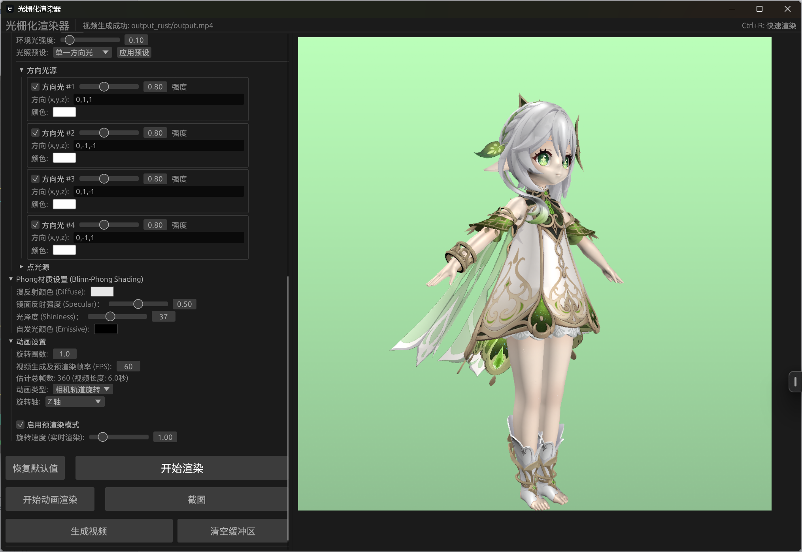

<!-- filepath: c:\Users\Yoimiya\Rasterizer_rust\README.md -->
# Rust 高性能光栅化渲染器 (GUI版)

一个使用Rust语言从零开始实现的软件光栅化渲染器。它利用CPU进行所有渲染计算，支持3D模型加载、多种投影方式、复杂光照模型（包括Blinn-Phong和PBR）、纹理映射、**实时相机交互**、动画生成、**增强环境光遮蔽(AO)**、**软阴影效果**以及一个基于egui的交互式图形用户界面（GUI）。

## 目录

- [Rust 高性能光栅化渲染器 (GUI版)](#rust-高性能光栅化渲染器-gui版)
  - [目录](#目录)
  - [核心功能](#核心功能)
  - [图形用户界面 (GUI)](#图形用户界面-gui)
    - [相机交互系统](#相机交互系统)
    - [GUI功能区域](#gui功能区域)
    - [实时渲染与动画](#实时渲染与动画)
  - [渲染管线](#渲染管线)
  - [安装与构建](#安装与构建)
    - [环境要求](#环境要求)
    - [构建步骤](#构建步骤)
  - [使用指南](#使用指南)
    - [GUI 模式](#gui-模式)
    - [命令行模式 (CLI)](#命令行模式-cli)
    - [命令行参数详解](#命令行参数详解)
      - [基础设置](#基础设置)
      - [文件与输出设置](#文件与输出设置)
      - [渲染基础设置](#渲染基础设置)
      - [物体变换控制](#物体变换控制)
      - [相机参数](#相机参数)
      - [光照基础参数](#光照基础参数)
      - [着色模型设置](#着色模型设置)
      - [🔥 增强渲染效果设置](#-增强渲染效果设置)
      - [背景与环境设置](#背景与环境设置)
      - [动画设置](#动画设置)
    - [命令行示例](#命令行示例)
      - [1. 基础渲染 (斯坦福兔子)](#1-基础渲染-斯坦福兔子)
      - [2. 带纹理的模型渲染 (Spot)](#2-带纹理的模型渲染-spot)
      - [3. PBR 渲染 (岩石模型)](#3-pbr-渲染-岩石模型)
      - [4. 🔥 增强AO和软阴影渲染](#4--增强ao和软阴影渲染)
      - [5. 生成动画序列 (相机轨道)](#5-生成动画序列-相机轨道)
  - [项目架构](#项目架构)
  - [未来展望](#未来展望)
  - [许可证](#许可证)

## 核心功能

- **🖱️ 交互式GUI**：基于 `egui` 实现，支持实时参数调整和渲染预览。
- **🎮 专业级相机交互**：
  - 鼠标拖拽平移视角
  - Shift+拖拽轨道旋转
  - 滚轮推拉缩放
  - 快捷键重置和聚焦
  - 可调节的交互敏感度
- **📦 3D模型加载**：支持 `.obj` 格式模型和MTL材质文件。
- **🔭 投影方式**：支持透视投影和正交投影。
- **💡 先进光照系统**：
  - Blinn-Phong 光照模型
  - 基于物理的渲染 (PBR) 工作流 (金属度/粗糙度)
  - **多光源系统**：支持多个方向光源和点光源同时工作
  - **光源预设**：内置单向光、三面光、混合光源等预设配置
  - 支持环境光、方向光、点光源（带衰减）
- **🎨 材质系统**：
  - 支持漫反射颜色、镜面反射强度、光泽度 (Phong)
  - 支持基础颜色、金属度、粗糙度、环境光遮蔽、自发光 (PBR)
  - 统一处理图像纹理、随机面颜色、以及材质定义的颜色
- **🌅 高级背景设置**：
  - **背景图片支持**：可加载任意PNG/JPG图像作为背景
  - **渐变背景**：可自定义顶部和底部颜色的平滑渐变
  - **地面平面**：可调整颜色和高度的地面反射面
- **⚡ 高级渲染特性**：
  - Z-Buffer 深度测试
  - Gamma 校正
  - 背面剔除
  - 线框模式
  - 小三角形剔除
  - 多线程渲染加速
  - **🔥 增强环境光遮蔽(Enhanced AO)**：基于法线朝向、边缘检测、曲率分析的高级AO效果
  - **🔥 软阴影(Soft Shadows)**：基于角度、深度、局部遮蔽的软阴影计算
- **🎬 动画与视频**：
  - 支持相机轨道旋转和物体局部旋转动画
  - 可自定义旋转轴
  - **预渲染模式**，用于流畅播放复杂动画
  - **实时动画渲染**，支持实时交互和帧率显示
  - 渲染帧序列并可使用 FFmpeg 合成为视频
- **🔧 物体变换控制**：
  - 实时位置、旋转、缩放调整
  - 独立的XYZ轴控制
  - 全局缩放和非均匀缩放
- **💾 输出功能**：可保存渲染结果（颜色图）和深度图。

## 图形用户界面 (GUI)

通过GUI，你可以方便地调整所有渲染参数，实时查看效果，并执行渲染、截图、生成视频等操作。GUI采用现代化设计，支持中文字体和直观的参数控制。

### 相机交互系统

GUI的核心亮点是**专业级3D相机交互系统**：

- **🖱️ 鼠标拖拽** - 平移相机视角，观察模型不同角度
- **⌨️ Shift+拖拽** - 轨道旋转，围绕模型中心观察
- **🔄 滚轮缩放** - 推拉距离调整，精确控制观察距离
- **⌨️ 快捷键操作** - R键重置视角，F键聚焦物体
- **🎛️ 敏感度调节** - 可独立调整平移、旋转、缩放的响应速度
- **📊 实时反馈** - 右下角显示交互状态和当前敏感度设置

### GUI功能区域

**顶部面板**：

- 应用标题和状态信息
- 实时帧率显示（仅在实时渲染时）
- 快捷键提示 (Ctrl+R: 快速渲染)

**左侧控制面板** (可滚动)：

- **文件与输出设置**：选择OBJ文件，设置输出目录、文件名、图像尺寸，控制深度图保存
- **渲染基础设置**：投影类型，深度缓冲、光照、纹理、面颜色、着色模型、Gamma校正、背面剔除、线框模式、多线程等开关
- **物体变换控制**：实时调整位置、旋转、缩放，带有拖拽控件和重置按钮
- **背景与环境**：背景图片、渐变背景颜色、地面平面设置
- **相机设置**：相机位置、目标点、上方向、视场角，以及交互敏感度调节
- **光照设置**：多光源配置，方向光和点光源，光源预设，环境光设置
- **PBR/Phong材质设置**：根据选择的着色模型显示相应的材质参数
- **🔥 增强渲染效果**：增强AO和软阴影的开关与强度控制
- **动画设置**：实时渲染控制，视频生成参数，预渲染模式

**底部操作按钮**：

- **恢复默认值** - 重置所有参数，保留文件路径
- **开始渲染** - 单帧渲染 (Ctrl+R)
- **实时动画** - 开始/停止实时动画渲染
- **截图** - 保存当前渲染结果
- **生成视频** - 后台渲染并合成MP4视频
- **清空缓冲区** - 清除预渲染帧，释放内存

**中央显示区域**：

- 渲染结果显示，支持相机交互
- 自适应图像尺寸显示
- 右下角悬浮交互提示面板

### 实时渲染与动画

GUI支持两种动画模式：

1. **实时动画渲染**：
   - 立即开始动画播放
   - 显示实时帧率统计
   - 支持相机交互调整观察角度
   - 可调节旋转速度

2. **预渲染模式**：
   - 预先计算所有动画帧
   - 确保流畅播放复杂场景
   - 适合高质量动画预览
   - 支持进度显示




## 渲染管线

以下是渲染器的完整管线流程，展示了从模型加载到最终图像生成的各个阶段：


## 安装与构建

### 环境要求

- **Rust**: 1.81 或更高版本 (推荐最新稳定版)
- **Cargo**: Rust包管理器 (随Rust一同安装)
- **FFmpeg**: (可选) 用于将渲染的帧序列合成为视频
  - **Ubuntu/Debian**: `sudo apt-get install ffmpeg libxcb-render0-dev libxcb-shape0-dev libxcb-xfixes0-dev libxkbcommon-dev libssl-dev pkg-config`
  - **macOS**: `brew install ffmpeg pkg-config`
  - **Windows**: 从 [FFmpeg官网](https://ffmpeg.org/download.html) 下载并将其可执行文件路径添加到系统PATH

### 构建步骤

1. **克隆项目**：

    ```bash
    git clone https://github.com/Rukkhadevata123/Rasterizer_rust
    cd Rasterizer_rust
    ```

2. **构建项目**：
    - 开发模式 (较快编译，带调试信息)：

        ```bash
        cargo build
        ```

    - 发布模式 (优化性能，用于最终运行，推荐)：

        ```bash
        cargo build --release # 二进制文件在target目录下
        ```

## 使用指南

### GUI 模式

推荐使用GUI模式进行交互式体验和参数调整。GUI模式是默认启动方式。

- **启动GUI** (无参数或未指定OBJ文件时自动启动)：

    ```bash
    cargo run --release
    ```

- **启动GUI并加载指定模型**：

    ```bash
    cargo run --release -- --obj path/to/your_model.obj
    ```

在GUI中进行3D模型观察和渲染：

1. **加载模型**：在"文件与输出设置"中选择OBJ文件
2. **调整参数**：通过左侧面板的各个折叠区域调整渲染参数
3. **🔥 配置增强效果**：在"增强渲染效果"区域启用并调整AO和软阴影强度
4. **相机交互**：在中央区域使用鼠标进行3D导航
5. **实时渲染**：点击"开始渲染"或按Ctrl+R进行单帧渲染
6. **动画播放**：启用实时动画渲染观察旋转效果
7. **视频生成**：配置动画参数后点击"生成视频"

### 命令行模式 (CLI)

当指定了OBJ文件路径时，程序进入命令行渲染模式，无需启动GUI。

- **基本渲染示例**：

    ```bash
    cargo run --release -- --obj obj/simple/bunny.obj --output my_render --width 800 --height 600
    ```

### 命令行参数详解

所有通过GUI可调的参数均可通过命令行参数设置。以下是主要参数列表：

#### 基础设置

| 参数                     | 描述                                                                 | 默认值                  |
| :----------------------- | :------------------------------------------------------------------- | :---------------------- |
| `--obj <PATH>`           | 输入的OBJ模型文件路径。若未提供则启动GUI模式。                        | (无，启动GUI)           |
| `--animate`              | 运行完整动画循环而非单帧渲染 (仅CLI模式)。                           | `false`                 |
| `--fps <NUM>`            | 动画帧率，用于视频生成和预渲染。                                      | `30`                    |
| `--rotation-speed <F>`   | 旋转速度系数，控制动画旋转的速度。                                    | `1.0`                   |
| `--rotation-cycles <F>`  | 完整旋转圈数，用于视频生成 (默认1圈)。                               | `1.0`                   |
| `--animation-type <TYPE>`| 动画类型：`CameraOrbit`, `ObjectLocalRotation`, `None`。             | `CameraOrbit`           |
| `--rotation-axis <AXIS>` | 动画旋转轴：`X`, `Y`, `Z`, `Custom`。                                | `Y`                     |
| `--custom-rotation-axis <X,Y,Z>`| 自定义旋转轴，格式 "x,y,z"。                              | `0,1,0`                 |

#### 文件与输出设置

| 参数                     | 描述                                                                 | 默认值                  |
| :----------------------- | :------------------------------------------------------------------- | :---------------------- |
| `--output <NAME>`        | 输出文件的基础名称 (例如: "render" -> "render_color.png")。          | `output`                |
| `--output-dir <DIR>`     | 输出图像的目录。                                                     | `output_rust`           |
| `--width <PIXELS>`       | 输出图像宽度。                                                       | `1024`                  |
| `--height <PIXELS>`      | 输出图像高度。                                                       | `1024`                  |
| `--save-depth`           | 启用渲染和保存深度图。                                               | `true`                  |

#### 渲染基础设置

| 参数                     | 描述                                                                 | 默认值                  |
| :----------------------- | :------------------------------------------------------------------- | :---------------------- |
| `--projection <TYPE>`    | 投影类型: "perspective" (透视) 或 "orthographic" (正交)。             | `perspective`           |
| `--use-zbuffer`          | 启用Z缓冲 (深度测试)。                                               | `true`                  |
| `--colorize`             | 使用伪随机面颜色而非材质颜色 (与 `--use-texture` 互斥)。              | `false`                 |
| `--use-texture`          | 启用纹理加载和使用 (与 `--colorize` 互斥)。                           | `true`                  |
| `--texture <PATH>`       | 显式指定要使用的纹理文件，覆盖MTL设置。                                | (无)                    |
| `--use-gamma`            | 启用Gamma校正。                                                      | `true`                  |
| `--backface-culling`     | 启用背面剔除。                                                       | `false`                 |
| `--wireframe`            | 以线框模式渲染。                                                     | `false`                 |
| `--use-multithreading`   | 启用多线程渲染。                                                     | `true`                  |
| `--cull-small-triangles` | 启用小三角形剔除。                                                   | `false`                 |
| `--min-triangle-area <F>`| 小三角形剔除的最小面积阈值 (屏幕空间比例)。                            | `1e-3`                  |

#### 物体变换控制

| 参数                     | 描述                                                                 | 默认值                  |
| :----------------------- | :------------------------------------------------------------------- | :---------------------- |
| `--object-scale <F>`     | 物体的全局均匀缩放因子。                                              | `1.0`                   |
| `--object-position <X,Y,Z>`| 物体位置，格式为 "x,y,z"。                                         | `0,0,0`                 |
| `--object-rotation <X,Y,Z>`| 物体旋转 (欧拉角，度)，格式为 "x,y,z"。                            | `0,0,0`                 |
| `--object-scale-xyz <X,Y,Z>`| 物体缩放，格式为 "x,y,z"。                                       | `1,1,1`                 |

#### 相机参数

| 参数                   | 描述                                                              | 默认值        |
| :--------------------- | :---------------------------------------------------------------- | :------------ |
| `--camera-from <X,Y,Z>`| 相机位置 (视点), 格式为 "x,y,z"。                                  | `0,0,3`       |
| `--camera-at <X,Y,Z>`  | 相机目标 (观察点), 格式为 "x,y,z"。                                | `0,0,0`       |
| `--camera-up <X,Y,Z>`  | 相机世界坐标系上方向, 格式为 "x,y,z"。                              | `0,1,0`       |
| `--camera-fov <DEG>`   | 相机垂直视场角 (度, 用于透视投影)。                                 | `45.0`        |

#### 光照基础参数

| 参数                     | 描述                                                                 | 默认值                  |
| :----------------------- | :------------------------------------------------------------------- | :---------------------- |
| `--use-lighting`         | 启用光照计算。                                                       | `true`                  |
| `--ambient <FACTOR>`     | 环境光强度因子 (会乘以环境光颜色)。                                    | `0.1`                   |
| `--ambient-color <R,G,B>`| 环境光RGB颜色 (0-1范围, 如 "0.1,0.1,0.1")。                           | `0.1,0.1,0.1`           |
| `--lighting-preset <P>`  | 光照预设: `SingleDirectional`, `ThreeDirectional`, `MixedComplete`, `None`。 | `SingleDirectional` |
| `--main-light-intensity <F>`| 主光源强度 (0.0-1.0)。                                           | `0.8`                   |

#### 着色模型设置

**Phong 着色模型** (默认启用):

| 参数                     | 描述                                                              | 默认值          |
| :----------------------- | :---------------------------------------------------------------- | :-------------- |
| `--use-phong`            | 使用Phong着色 (逐像素光照)。                                         | `true`         |
| `--diffuse-color <R,G,B>`| 漫反射颜色 (0-1范围, 如 "0.8,0.8,0.8")。                             | `0.8,0.8,0.8`   |
| `--specular <FACTOR>`    | 镜面反射强度 (0.0-1.0)。                                           | `0.5`           |
| `--shininess <FACTOR>`   | 材质的光泽度 (硬度) 参数 (通常 1.0-200.0)。                          | `32.0`          |

**PBR 材质设置** (可选启用):

| 参数                       | 描述                                                              | 默认值          |
| :------------------------- | :---------------------------------------------------------------- | :-------------- |
| `--use-pbr`                | 使用基于物理的渲染 (PBR) 而不是传统Blinn-Phong。                    | `false`         |
| `--base-color <R,G,B>`     | 材质的基础颜色 (0-1范围, 如 "0.8,0.8,0.8")。                         | `0.8,0.8,0.8`   |
| `--metallic <FACTOR>`      | 材质的金属度 (0.0-1.0)。                                           | `0.0`           |
| `--roughness <FACTOR>`     | 材质的粗糙度 (0.0-1.0)。                                           | `0.5`           |
| `--ambient-occlusion <F>`  | 环境光遮蔽系数 (0.0-1.0)。                                         | `1.0`           |

**通用材质参数**:

| 参数                     | 描述                                                              | 默认值          |
| :----------------------- | :---------------------------------------------------------------- | :-------------- |
| `--emissive <R,G,B>`     | 材质的自发光颜色 (0-1范围, 如 "0.0,0.0,0.0")。                      | `0.0,0.0,0.0`   |

#### 🔥 增强渲染效果设置

| 参数                     | 描述                                                              | 默认值          |
| :----------------------- | :---------------------------------------------------------------- | :-------------- |
| `--enhanced-ao`          | 启用增强环境光遮蔽(Enhanced AO)效果。                             | `true`          |
| `--ao-strength <F>`      | 环境光遮蔽强度 (0.0-1.0)，数值越大遮蔽效果越明显。                  | `0.5`           |
| `--soft-shadows`         | 启用软阴影(Soft Shadows)效果。                                   | `true`          |
| `--shadow-strength <F>`  | 软阴影强度 (0.0-1.0)，数值越大阴影效果越明显。                      | `0.7`           |

**🔥 增强AO特性**：

- **法线朝向分析**：朝下的表面产生更强的遮蔽效果
- **边缘检测**：三角形边缘区域自动增强遮蔽
- **曲率分析**：基于法线变化检测凹陷区域
- **位置相关遮蔽**：根据在三角形内的位置调整遮蔽强度

**🔥 软阴影特性**：

- **角度软化**：在掠射角处产生更柔和的阴影过渡
- **深度相关遮蔽**：距离相机较远的区域增强环境遮蔽
- **局部遮蔽**：基于法线变化计算局部阴影
- **多光源支持**：为每个光源独立计算软阴影因子

#### 背景与环境设置

| 参数                             | 描述                                     | 默认值            |
| :------------------------------- | :--------------------------------------- | :---------------- |
| `--enable-gradient-background`   | 启用渐变背景。                           | `false`           |
| `--gradient-top-color <R,G,B>`   | 渐变背景顶部颜色 (0-1范围, 如 "0.5,0.7,1.0")。 | `0.5,0.7,1.0`     |
| `--gradient-bottom-color <R,G,B>`| 渐变背景底部颜色 (0-1范围, 如 "0.1,0.2,0.4")。 | `0.1,0.2,0.4`     |
| `--enable-ground-plane`          | 启用地面平面。                           | `false`           |
| `--ground-plane-color <R,G,B>`   | 地面平面颜色 (0-1范围, 如 "0.3,0.5,0.2")。   | `0.3,0.5,0.2`     |
| `--ground-plane-height <Y>`      | 地面平面在Y轴上的高度 (世界坐标系, <=0)。  | `-1.0`            |
| `--use-background-image`         | 启用背景图片。                           | `false`           |
| `--background-image-path <PATH>` | 背景图片的路径。                          | (无)              |

#### 动画设置

| 参数                        | 描述                                                                   | 默认值            |
| :-------------------------- | :--------------------------------------------------------------------- | :---------------- |
| `--animate`                 | 渲染动画序列而非单帧 (仅CLI模式)。                                       | `false`           |
| `--fps <NUM>`               | 视频生成及预渲染帧率（每秒帧数）。                                        | `30`              |
| `--rotation-cycles <NUM>`   | 动画完成的旋转圈数，影响生成的总帧数。                                    | `1.0`             |
| `--animation-type <TYPE>`   | 动画类型: `CameraOrbit`, `ObjectLocalRotation`, `None`。                 | `CameraOrbit`     |
| `--rotation-axis <AXIS>`    | 动画旋转轴: `X`, `Y`, `Z`, `Custom`。                                    | `Y`               |
| `--custom-rotation-axis <X,Y,Z>` | 自定义旋转轴 (当 `rotation-axis` 为 `Custom` 时使用), 格式 "x,y,z"。 | `0,1,0`           |
| `--rotation-speed <FACTOR>` | 实时渲染中的旋转速度倍率。                                              | `1.0`             |

### 命令行示例

以下示例演示了如何使用命令行参数进行不同类型的渲染：

#### 1. 基础渲染 (斯坦福兔子)

使用Phong着色渲染默认的兔子模型。

```bash
cargo run --release -- \
    --obj obj/simple/bunny.obj \
    --output-dir output_bunny_phong \
    --output bunny_phong_render \
    --width 1024 \
    --height 1024 \
    --camera-from "0,0.1,2.5" \
    --camera-at "0,0.1,0" \
    --use-phong
```

#### 2. 带纹理的模型渲染 (Spot)

渲染Spot模型，并使用其纹理。

```bash
cargo run --release -- \
    --obj obj/models/spot/spot_triangulated.obj \
    --texture obj/models/spot/spot_texture.png \
    --output-dir output_spot_textured \
    --output spot_textured_render \
    --width 1024 \
    --height 1024 \
    --camera-from "0,0.5,3" \
    --camera-at "0,0.5,0" \
    --use-phong \
    --use-texture
```

#### 3. PBR 渲染 (岩石模型)

使用PBR参数渲染岩石模型，并应用混合光源和渐变背景。

```bash
cargo run --release -- \
    --obj obj/models/rock/rock.obj \
    --texture obj/models/rock/rock.png \
    --output-dir output_rock_pbr \
    --output rock_pbr_render \
    --width 1280 \
    --height 720 \
    --camera-from "3,0.5,3" \
    --camera-at "0,0.5,0" \
    --lighting-preset MixedComplete \
    --ambient 0.3 \
    --ambient-color "0.5,0.5,0.55" \
    --use-pbr \
    --metallic 0.1 \
    --roughness 0.8 \
    --base-color "0.9,0.85,0.8" \
    --ambient-occlusion 0.9 \
    --enable-gradient-background \
    --gradient-top-color "0.4,0.6,0.9" \
    --gradient-bottom-color "0.8,0.8,0.9"
```

#### 4. 🔥 增强AO和软阴影渲染

展示增强AO和软阴影效果的高质量渲染。

```bash
cargo run --release -- \
    --obj obj/simple/bunny.obj \
    --output-dir output_bunny_enhanced \
    --output bunny_enhanced_render \
    --width 1024 \
    --height 1024 \
    --camera-from "0,0.1,2.5" \
    --camera-at "0,0.1,0" \
    --lighting-preset ThreeDirectional \
    --ambient 0.2 \
    --ambient-color "0.3,0.3,0.4" \
    --use-phong \
    --enhanced-ao \
    --ao-strength 0.8 \
    --soft-shadows \
    --shadow-strength 0.6 \
    --enable-gradient-background \
    --gradient-top-color "0.7,0.8,1.0" \
    --gradient-bottom-color "0.2,0.3,0.5"
```

#### 5. 生成动画序列 (相机轨道)

为兔子模型生成一个相机轨道动画序列，完成一整圈旋转。

```bash
cargo run --release -- \
    --obj obj/simple/bunny.obj \
    --output-dir output_bunny_orbit_cli \
    --output frame \
    --width 800 \
    --height 600 \
    --camera-from "0,0.1,2.5" \
    --camera-at "0,0.1,0" \
    --use-phong \
    --enhanced-ao \
    --ao-strength 0.6 \
    --soft-shadows \
    --shadow-strength 0.5 \
    --animate \
    --rotation-cycles 1.0 \
    --fps 30 \
    --animation-type CameraOrbit \
    --rotation-axis Y
```

然后，你可以使用FFmpeg将 `output_bunny_orbit_cli` 目录下的 `frame_XXX_color.png` 文件合成为视频：

```bash
ffmpeg -y -framerate 30 -i output_bunny_orbit_cli/frame_%03d_color.png -c:v libx264 -pix_fmt yuv420p bunny_orbit_cli.mp4
```

## 项目架构

项目采用模块化设计，以下是 src 目录的主要结构：

```bash
src/
├── core/                    # 核心渲染组件
│   ├── frame_buffer.rs      # 帧缓冲区管理
│   ├── geometry_processor.rs # 几何处理管线
│   ├── rasterizer.rs        # 🔥 光栅化算法实现 (含增强AO和软阴影)
│   ├── renderer.rs          # 主渲染器逻辑
│   ├── triangle_processor.rs # 三角形处理和光栅化
│   └── mod.rs               # 核心模块声明
├── geometry/                # 几何处理模块
│   ├── camera.rs            # 相机实现与交互系统
│   ├── culling.rs           # 剔除算法 (背面、小三角形等)
│   ├── interpolation.rs     # 插值算法
│   ├── transform.rs         # 几何变换 (视图、投影、模型变换等)
│   └── mod.rs               # 几何模块声明
├── io/                      # 输入输出处理
│   ├── loaders.rs           # 模型文件加载 (OBJ等)
│   ├── render_settings.rs   # 🔥 统一的渲染设置与参数处理 (含AO/阴影参数)
│   ├── resource_loader.rs   # 统一资源加载器
│   └── mod.rs               # IO模块声明
├── material_system/         # 材质相关模块
│   ├── color.rs             # 颜色相关的定义与操作
│   ├── light.rs             # 光源定义与管理，支持多光源和预设
│   ├── materials.rs         # 材质定义 (Phong, PBR等)
│   ├── texture.rs           # 纹理加载与管理
│   └── mod.rs               # 材质系统模块声明
├── scene/                   # 场景管理
│   ├── scene_object.rs      # 场景对象定义与变换控制
│   ├── scene_utils.rs       # 场景管理工具与统计
│   └── mod.rs               # 场景模块声明
├── ui/                      # 用户界面模块
│   ├── animation.rs         # 动画控制与预渲染逻辑
│   ├── app.rs               # eframe/egui 应用主逻辑与相机交互
│   ├── core.rs              # UI核心方法和状态管理
│   ├── render_ui.rs         # 渲染调用和结果显示
│   ├── widgets.rs           # 🔥 自定义UI组件和侧边栏绘制 (含AO/阴影控件)
│   └── mod.rs               # UI模块声明
├── utils/                   # 工具函数
│   ├── model_utils.rs       # 模型处理相关的工具函数
│   ├── render_utils.rs      # 渲染相关的工具函数
│   ├── save_utils.rs        # 图像保存等工具函数
│   └── mod.rs               # 工具模块声明
└── main.rs                  # 程序入口点
```

**各主要模块功能概览：**

- **`core`**: 包含渲染器核心组件，包括帧缓冲区、几何处理器、🔥**增强光栅化器**和三角形处理器
- **`geometry`**: 处理几何变换、相机系统（含交互功能）、插值和剔除等
- **`material_system`**: 定义材质、光源、颜色和纹理，支持多种光源类型和预设
- **`scene`**: 管理场景对象和变换，包括场景统计和对象控制
- **`io`**: 负责输入/输出，包括🔥**增强参数解析**和资源加载
- **`ui`**: 实现完整的图形用户界面，包括相机交互、动画控制、🔥**AO/阴影参数调整**等
- **`utils`**: 包含各种辅助函数，如模型处理、渲染辅助和保存图像

**🔥 增强渲染特性：**

- **增强环境光遮蔽(Enhanced AO)**: 基于法线朝向、边缘检测、曲率分析和位置相关的高级AO算法
- **软阴影(Soft Shadows)**: 基于角度软化、深度相关遮蔽和局部遮蔽的软阴影计算
- **智能强度控制**: 可调节的强度参数，支持从微妙到显著的效果变化
- **多着色模型支持**: 同时支持PBR、Phong和Flat着色模式的增强效果

**核心设计特点：**

- **模块化架构**: 清晰的功能分离，便于维护和扩展
- **统一参数管理**: `RenderSettings` 同时支持CLI和GUI模式
- **专业相机系统**: 支持工业级3D软件标准的相机交互
- **多线程渲染**: 充分利用现代CPU的多核性能
- **实时交互**: GUI支持实时参数调整和相机操作
- **🔥 高级视觉效果**: 增强AO和软阴影提供电影级的渲染质量

## 未来展望

- **🌫️ 阴影映射** - Shadow Mapping，正在开发中
- **🎨 高级材质系统** - 次表面散射、清漆层、各向异性材质
- **⚡ 后处理效果** - 抗锯齿AA、景深DoF、辉光Bloom、色调映射
- **🔥 屏幕空间效果** - SSAO、SSR（屏幕空间反射）、SSGI（屏幕空间全局光照）
- **🦴 骨骼动画支持** - 角色动画和蒙皮
- **🎬 动画编辑器** - 关键帧动画系统
- **🔧 场景编辑器** - 多对象场景管理和编辑
- **📊 性能分析器** - 渲染性能监控和优化
- **🎮 VR/AR支持** - 立体渲染和沉浸式体验

## 许可证

本项目采用 MIT 许可证。详见 LICENSE 文件。
